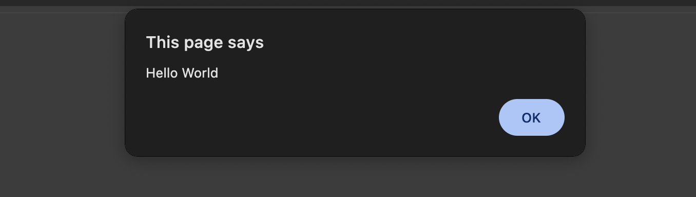

# Javascript - Syntax, Variables, and Simple Operations

## Resources

### References

- [MDN Web Docs - JavaScript](https://developer.mozilla.org/en-US/docs/Web/JavaScript)
- [JavaScript console.log() Method](https://developer.mozilla.org/en-US/docs/Web/API/console/log)
- [Variables](https://developer.mozilla.org/en-US/docs/Web/JavaScript/Guide/Grammar_and_types#variables)
- [Declarations](https://developer.mozilla.org/en-US/docs/Web/JavaScript/Guide/Grammar_and_types#declarations)
- [JavaScript let Statement](https://developer.mozilla.org/en-US/docs/Web/JavaScript/Reference/Statements/let)  
- [JavaScript const Statement](https://developer.mozilla.org/en-US/docs/Web/JavaScript/Reference/Statements/const)  	
- [JavaScript String](https://developer.mozilla.org/en-US/docs/Web/JavaScript/Reference/Global_Objects/String)  		
- [Single VS Double Quotes For Strings In JavaScript](https://flexiple.com/double-vs-single-quotes-javascript/) 
- [JavaScript Number](https://developer.mozilla.org/en-US/docs/Web/JavaScript/Reference/Global_Objects/Number) 		
- [JavaScript Boolean](https://developer.mozilla.org/en-US/docs/Web/JavaScript/Reference/Global_Objects/Boolean) 	
- [JavaScript Arrays](https://developer.mozilla.org/en-US/docs/Web/JavaScript/Reference/Global_Objects/Array)
- [JavaScript Objects](https://developer.mozilla.org/en-US/docs/Web/JavaScript/Reference/Global_Objects/Object)
- [JavaScript Null](https://developer.mozilla.org/en-US/docs/Web/JavaScript/Reference/Global_Objects/null)
- [JavaScript Undefined](https://developer.mozilla.org/en-US/docs/Web/JavaScript/Reference/Global_Objects/undefined)
- [Boodle](https://boodle.zuitt.co/login/) 		
	
    
### Tools/Technologies Version
- N/A

## Code Discussion

### 1. Folder and File Preparation
#### batchfolder > individual > s22 > discussion > index.html

```html
<!DOCTYPE HTML>
<html>
    <head>
        <title>JavaScript - Syntax, Variables, and Simple Operations</title>
    </head>
    <body>
    </body>
</html>
```
JavaScript renders web pages in an interactive and dynamic fashion. Meaning, it enables you to create dynamically updating content, control multimedia, animate images

*Let get started by introducing the basic syntax elements of JavaScript.*

#### [SECTION] Syntax, Statements, and Comments

- Statements in programming are instructions that we tell the computer to perform
- JS statements usually end with semicolon (;)
- Semicolons are not required in JS, but we will use it to help us train to locate where a statement ends
- A syntax in programming, it is the set of rules that describes how statements must be constructed
- All lines/blocks of code should be written in a specific manner to work. This is due to how these codes were initially programmed to function and perform in a certain manner


### 2. Let's try to make a simple alert in our html file. To show that we can also incorporate javascript inside of html file.
#### batchfolder > individual > s22 > discussion > index.html

**Where To Place JavaScript**
- Inline You can place JavaScript right into the HTML page using the script tags. This is good for very small sites and testing only. The inline approach does not scale well, leads to poor organization, and code duplication.
- External File A better approach is to place JavaScript into separate files and link to them from the HTML page. This way a single script can be included across thousands of HTML pages, and you only have one place to edit your JavaScript code. This approach is also much easier to maintain, write, and debug.

**Use of the Script Tag**
- In the past, we had to worry about specifying many attributes for the script tag. 

**Where should I place the Script Tags?**
- The script tags can go anywhere on the page, but as a best practice, many developers will place it just before the closing body tag on the HTML page. This provides faster speed load times for your web page.

```html
<!DOCTYPE HTML>
<html>
    <head>
        <title>JavaScript - Syntax, Variables, and Simple Operations</title>
    </head>
    <body>
        <script>
            alert("Hello World");
        </script>
    </body>
</html>
```

**Discussion Output**



### 3. We can also type a simple statement in dev tools > Console.
#### Browser > Inspect > Console

```js
alert("Hello Again");
```

- we used devtools not just to manipulate css but also allowing you to DEBUG, view messages and run JavaScript code in the console tab.
- Whitespace (basically, spaces and line breaks) can impact functionality in many computer languages—but not in JavaScript.  In JavaScript, whitespace is used only for readability and has no functional impact.  One effect of this is that a single statement can span multiple lines.

- This is a statement:
```js
console.log("Hello World");
```

- This code will do the exact same thing:
```js
console. log ( "Hello World " ) ; 
```

- And so will this:
```js
console.
log
(
    "Hello World"
)
```

**Important Note**
- Convention: Breaking up long statements into multiple lines is common practice, because it is easier to read (and prevents you from having to scroll horizontally as when reading scripts).
- There is one case where whitespace is actually functional: newlines can be used in place of semicolons to separate statements.  But this can cause issues in fringe cases, so as a general rule semicolons should always be used.
- Alternatively, JavaScript code can be executed in the in the Google Browser's console. This can be opened in several ways:
    - All Operating systems
        - Right Click + Inspect
    - Linux and Windows
        - Ctrl + Shift + I
    - Mac
        - Option + Command + J
- Any line/block of code added inside a JavaScript file can also be executed in the Google Browser's Console.
- Any line/block of code entered in the console will only be available for a certain session because all the information is stored in the device's local memory.
- Refreshing the browser will remove all previous code added in the console.
- Refer to "references" section of this file to find the documentation for JavaScript console.log() Method.

### 4. Create an "index.js" file.
#### batchfolder > individual > s22 > discussion > index.js

```js
// Comments:
    // Comments are parts of the code that gets ignored by the language
    // Comments are meant to describe the written code

    /*
    There are two types of comments:
        1. The single-line comment denoted by two slashes
        2.The multi-line comment denoted by a slash and asterisk 
    */  
```

### 5. Link the "index.js" script file to our HTML file by adding src inside the script to link it externally. Then *Delete* the alert message.
#### batchfolder > individual > s22 > discussion > index.html

```html
<!DOCTYPE HTML>
<html>
    <!-- ... -->
    <body>
        <script src="./index.js"></script>
    </body>
</html>
```

**Important Note:**
- The "script" tag is commonly placed at the bottom of the HTML file right before the closing "body" tag.
- The reason for this is because Javascript's main function in frontend development is to make our websites and applications interactive.
- In order to achieve this, JavaScript selects/targets specific HTML elements in our application and performs a certain output.
- It is added last to allow all HTML and CSS resources to load first before applying any JavaScript code to run.
- Placing the "script" tag at the top the the file might result in errors because since the HTML elements have not yet been loaded when the JavaScript loads, it does not have any valid HTML elements to target/select.


### 6. Create a variable and print it's value in the browser console.
#### batchfolder > individual > s22 > discussion > index.js

*To make sure that the js file is connected to html file*
```js
console.log("Hello World");
```

#### [SECTION] Variables, Declarations, and Initialization


**Variables:**
- You use variables as symbolic names for values in your application. The names of variables, called **identifiers**
- It is used to contain data.
- Any information that is used by an application is stored in what we call a "memory"
- When we create variables, certain portions of a device's memory is given a "name" that we call "variables"
- This makes it easier for us associate information stored in our devices to actual "names" about information

*and this variable need to declare, just like how we call your names*

**Declaring variables:**

- Declaring variables - tells our devices that a variable name is created and is ready to store data
- Declaring a variable without giving it a value will automatically assign it with the value of "undefined", meaning the variable's value was "not defined".

**JavaScript has three kinds of variable declarations.**
- **var** - Declares a variable, optionally initializing it to a value.
- **let** - Declares a block-scoped, local variable, optionally initializing it to a value.
- **const** - Declares a block-scoped, read-only named constant.

```js
//Syntax
//let/const/var variableName;

let myVariable;
//If you attempt to use a variable without defining it first, an error will occur due to its undefined status.

// console.log() is useful for printing values of variables or certain results of code into the Google Chrome Browser's console
// Constant use of this throughout developing an application will save us time and builds good habit in always checking for the output of our code

console.log(myVariable); //the result is undefined because we don't have any data stored in our variable.


// Trying to print out a value of a variable that has not been declared will return an error of "not defined"
// The "not defined" error in the console refers to the variable not being created/defined, whereas in the previous example, the code refers to the "value" of the variable as not defined.
console.log(hello);

// Variables must be declared first before they are used
// Using variables before they're declared will return an error
let hello;

//This is the right way to declare variable
//let hello;
//console.log(hello)
```

**Guides in writing variables:**
1. Use the 'let' keyword followed by the variable name of your choosing and use the assignment operator (=) to assign a value.
2. Variable names should start with a lowercase character, use camelCase for multiple words.
3. For constant variables, use the 'const' keyword.
4. Variable names should be indicative (or descriptive) of the value being stored to avoid confusion.

**Best practices in naming variables:**
1. When naming variables, it is important to create variables that are descriptive and indicative of the data it contains.
```js
//1. Descriptive
let firstName = "Michael"; // good variable name
let pokemon = 25000; // bad variable name
```

2. When naming variables, it is better to start with a lowercase letter. We usually avoid creating variable names that starts with capital letters. Because there are several keywords in JS that start in capital letter.
```js
//2. Start with a lowercase letter
let FirstName = "Michael"; // bad variable name
let firstName = "Michael"; // good variable name
```

3. Do not add spaces to your variable names. Use camelCase for multiple words, or underscores.
```js
//3. Do not add spaces 
let first name = "Mike";
```

- camelCase is when we have first word in small caps and the next word added without space but is capitalized:
```js
//3. Do not add spaces 
let first name = "Mike";
//camelCase
let emailAddress = "mike@email.com";
```
- sample: **lastName emailAddress mobileNumber**

- Underscores sample:
```js
let product_description = "lorem ipsum";
let product_id = "250000ea1000";
```
4. Avoid using a variable with a reserved keyword.
```js
const let = "hello"; //SyntaxError: let is disallowed as a lexically bound name
console.log(let);
```

If you are unsure, you can [check your variable name](https://mothereff.in/js-variables)) to see if it's valid.

**Important Note:**
- For every line/block of code added in the discussion, add a console.log() Method to print out the output.
- This will visually demonstrate to the students what the codes do.
- This will also build a good habit of checking the output which applies not just to Javascript but for all programming languages.
- This helps build character that will promote growth as a developer ensuring that every step of the development everything is working as intended as opposed to the bad habit of inputting lines and blocks of codes without testing them and eventually having difficulty tracing the error due to the numerous additions to the source code.
- Refer to "references" section of this file to find the documentation for Variables and Memory Locations.


### 6. Create additional variables to demonstrate the variable declaration and initialization.
#### batchfolder > individual > s22 > discussion > index.js

```js
/*...*/
// let hello;

// Declaring and initializing variables
// Initializing variables - the instance when a variable is given it's initial/starting value
// Syntax
    // let/const variableName = value;
let productName = 'desktop computer';
console.log(productName);

let productPrice = 18999;
console.log(productPrice);
```
- In the context of certain applications, some variables/information are constant and should not be changed
- In this example, the interest rate for a loan, savings account or a mortgage must not be changed due to real world concerns
- This is the best way to prevent applications from suddenly breaking or performing in ways that are not intended
```js
const interest = 3.539;
```

**Let's expound the used of *let* and *const***
*When to use let, and const?*

- **let** - usually used if we want to reassign the values in our variable
- **const** - usually used if we don't want to change the value in our variable

*How about the var?*
- it's generally not considered a best practice to use var in modern JavaScript. 
- It has some characteristics that can lead to unexpected behavior and make code harder to maintain. 
- Instead, using let and const is recommended, as they provide block-scoping and clearer variable behavior, promoting better code practices. (Block-scoping will be discussed on our further sessions of Javascript-specifically in s24-functions)
- You can refer to this [link](https://developer.mozilla.org/en-US/docs/Web/JavaScript/Guide/Grammar_and_types#variable_hoisting) for more information about variable hoisting.

**Reassigning Variable Values**
- Reassigning a variable means changing it's initial or previous value into another value
- Syntax: variableName = newValue;

- in our example, we already initialized a value with the used of let in productName variable. Let's try to re assign it with new value.
```js
// Reassigning variable values
productName = 'Laptop';
console.log(productName);

//let variable cannot be re-declared within its scope. So while this will work:
let friend = 'Kate';
friend = 'Jane';

//this will return an error
let friend = 'Kate';
let friend = 'Jane'; // error: Identifier 'friend' has already been declared
```

```js
//while const cannot be updated or re-declared
// Values of constants cannot be changed and will simply return an error
//let's use the const that we declared earlier:
interest = 4.489; //TypeError: Assignment to constant variable.
```
- So if we declare a variable with const, we can neither update nor the variable identifier cannot be reassigned

**Reassigning variables vs Initializing Variables**

```js
// Declares a variable first
let supplier;
// Initialization is done after the variable has been declared
// This is considered as initialization because it is the first time that a value has been assigned to a variable
supplier = "John Smith Tradings";
console.log(supplier);
// This is considered as reassignment because it's initial value was already declared
supplier = "Zuitt Store";
console.log(supplier);
```

*Can you declare a const variable without initialization? **No. An error will occur.***
```js
//example:
const pi; //SyntaxError: Missing initializer in const declaration
pi=3.1416; 
console.log(pi)
```
- const variables are variables with constant data. Therefore we should not re-declare,re-assign or even declare a const variable without initialization.

**Important Note:**
- Refer to "references" section of this file to find the documentations for JavaScript let and const Statements.

### 7. Create multiple variables to demonstrate JavaScript's primitive and commonly used data types.
#### batchfolder > individual > s22 > discussion > index.js

#### [SECTION] Data Types
Note that variables may hold values that have different data types:

**Important Notes**
- Refer to "references" section of this file to find the documentation for Data Types.

**We will discuss the most commonly used data types**

**1. Boolean**
- Boolean values are normally used to store values relating to the state of certain things
- This will be useful in further discussions about creating logic to make our application respond to certain scenarios
```js
// [SECTION] Data Types

// 1. Boolean
let isMarried = false;
let inGoodConduct = true;
console.log("isMarried: " + isMarried);
console.log("isGoodConduct: " + inGoodConduct);
```

**2. null**
- It is used to **intentionally** express the absence of a value in a variable declaration/initialization
- null simply means that a data type was assigned to a variable but it does not hold any value/amount or is nullified
- when dealing with the special value null, it must be written in lowercase. Using variations like Null, NULL, or any other case combination will result in an error or won't be recognized as the reserved keyword null.
```js
// 2. null
//null is use when you want to explicitly indicate that a variable has no value or is intentionally empty.
let spouse = null;
```

**3. undefined**
- Represents the state of a variable that has been declared but without an assigned value
```js
// 3. Undefined
let fullName;
console.log(fullName);
``` 

**Undefined vs Null**
- One clear difference between undefined and null is that for undefined, a variable was created but was not provided a value
- null means that a variable was created and was assigned a value that does not hold any value/amount
- Certain processes in programming would often return a "null" value when certain tasks results to nothing. For example, attempting to retrieve data from a database could return null if the requested data is not available.
// null is also considered as a data type of it's own


**4. Numbers**
```js
// 4. Number

//Integers/Whole Numbers
let myNumber = 0;
let headcount = 26;
console.log(headcount);

//Decimal Numbers/Fractions
let grade = 98.7;
console.log(grade);

// Exponential Notation
let planetDistance = 2e10;
console.log(planetDistance);
```


**5. BigInt**
- An integer with arbitrary precision.
- Very large integers that cannot be exactly represented are automatically rounded. Unexpected rounding can compromise a program’s reliability and security. That's why we need BigInt.
- Arithmetic operations on large integers can now be performed in standard JavaScript without risking loss of precision by using BigInt
```js
// 5. BigInt
const bigInteger = 9007199254740992n; //The n is used to explicitly denote that the number should be treated as a BigInt rather than a regular JavaScript number.

console.log(bigInteger);
```

**6. Strings**
- Strings are a series of characters that create a word, a phrase, a sentence or anything related to creating text
- Strings in JavaScript can be written using either a single (') or double (") quote
```js
// 6. String
let myString = '';
let country = 'Philippines';
let province = "Metro Manila"; 
```

**7. Arrays**
- in JavaScript, an array is a special type of object.
- Arrays are used to store ordered collections of values, and each value in an array is associated with a numeric index. 
- The indices start from 0.
- Arrays can store different data types but is normally used to store similar data types
```js
// 7. Arrays
// similar data types
// Syntax
    // let/const arrayName = [elementA, elementB, elementC, ...]
let grades = [98.7, 92.1, 90.2, 94.6];
console.log(grades);

// different data types
// storing different data types inside an array is not recommended because it will not make sense to in the context of programming
let details = ["John", "Smith", 32, true];
console.log(details);
```


**8. Objects**
- Objects are another special kind of data type that's used to mimic real world objects/items
- They're used to create complex data that contains pieces of information that are relevant to each other
- Every individual piece of information is called a property of the object
```js
// 8. Object
// Syntax
    // let/const objectName = {
    //     propertyA: value,
    //     propertyB: value,
    // }

let person = {

    fullName: 'Juan Dela Cruz',
    age: 35,
    isMarried: false,
    contact: ["+63917 123 4567", "8123 4567"],
    address: {
        houseNumber: '345',
        city: 'Manila'
    }

}

console.log(person);

// They're also useful for creating abstract objects
let myGrades = {
    firstGrading: 98.7, 
    secondGrading: 92.1, 
    thirdGrading: 90.2, 
    fourthGrading: 94.6
}

console.log(myGrades);
```


**Important Note:**
- Arrays and Objects will be discussed in further details during the succeeding sessions.
- They were added in the discussion to give students an idea that they also fall under the category of JavaScript data types and are part of it's fundamentals.
- Refer to "references" section of this file to find the documentations for JavaScript String, Single VS Double Quotes For Strings In JavaScript, JavaScript Escape Characters, JavaScript Number, JavaScript Boolean, JavaScript Arrays and JavaScript Objects.
- We can change the element of an array assigned to a constant variable or change the object's properties assigned to a constant variable. However, we cannot re-assign a new array or object to the constant variable.
	


## Activity

### Activity References
- [Concatenate Strings using + Operator](https://developer.mozilla.org/en-US/docs/Learn/Getting_started_with_the_web/JavaScript_basics#operators)
- [JavaScript Escape Characters](https://www.geeksforgeeks.org/what-are-escape-characters-in-javascript/)
- [Single VS Double Quotes For Strings In JavaScript](https://www.w3schools.com/js/js_strings.asp)  
- [JavaScript TypeOf Operator](https://developer.mozilla.org/en-US/docs/Web/JavaScript/Reference/Operators/typeof)
- [JavaScript let in JavaScript](https://developer.mozilla.org/en-US/docs/Web/JavaScript/Reference/Statements/let)
- [JavaScript const in JavaScript](https://developer.mozilla.org/en-US/docs/Web/JavaScript/Reference/Statements/const)
- [JavaScript Number](https://developer.mozilla.org/en-US/docs/Web/JavaScript/Reference/Global_Objects/Number) 		
- [JavaScript Boolean](https://developer.mozilla.org/en-US/docs/Web/JavaScript/Reference/Global_Objects/Boolean) 	
- [JavaScript Arrays](https://developer.mozilla.org/en-US/docs/Web/JavaScript/Reference/Global_Objects/Array)
- [JavaScript Objects](https://developer.mozilla.org/en-US/docs/Web/JavaScript/Reference/Global_Objects/Object)
- [JavaScript Null](https://developer.mozilla.org/en-US/docs/Web/JavaScript/Reference/Global_Objects/null)
- [JavaScript Undefined](https://developer.mozilla.org/en-US/docs/Web/JavaScript/Reference/Global_Objects/undefined)
- [MDN Web Docs - JavaScript](https://developer.mozilla.org/en-US/docs/Web/JavaScript)
- [JavaScript console.log() Method](https://developer.mozilla.org/en-US/docs/Web/API/console/log)
- [Variables](https://developer.mozilla.org/en-US/docs/Web/JavaScript/Guide/Grammar_and_types#variables)


### Activity Instructions
- Type of Activity:
    - Coding
    - Individual Activity

- Note: Copy the code from activity-template.js into any code sharing platform so students can copy the template of the code for this activity.

#### Instructions
1. In the s22 folder, create an activity folder, an index.html file inside of it and link the index.js file.
2. Create an index.js file and console log the message Hello World to ensure that the script file is properly associated with the html file.
3. Copy the activity code from your Instructor. Paste the activity code to your index.js file.
4. Research how to concatenate strings using + operator in Javascript. 
    - Create two variables with a street, and a city.
    - Concatenate them to form a full address.
    - Log the full address to the console using the variable: "fullAddress"
    - Example: Timog Ave, Quezon City
5. Research how to combine text with Strings in Javascript
    - Create  variable named messageLog to store a message
    - Log the message "I live in" and your full address to the console.
    - Example: I live in Timog Ave, Quezon City
6. Research the use of the escape character in Javascript strings.
    - Create a string with a sentence: I'm learning JavaScript., but use the escape character for the single quote using the variable: “sentenceWithEscape”.
    - Create another string with the same sentence that includes a single quote (') without using the escape character using the variable: “sentenceWithoutEscape”.
    - Log both strings to the console and observe the difference.
7. Research the use of the escape character in Javascript strings.
    - Create a paragraph variable and log it like this:
        "JavaScript is a powerful programming language.
        It is used for web development, server-side scripting, and more.
        Learning JavaScript opens up many opportunities for developers."
8. Research how to determine the data type of each variable.
    - Add the variables of different primitive data types: 
        - str = "Twice"
        - num = 27
        - bool = true
        - nul = null
        - undf = undefined
        - arr = ["Dahyun", "Chaeyoung", "Mina"]
        - obj = { twice: "Dahyun" }
    - Use the operator to determine the data type of each variable.
    - Log the result to the console.
9. Analyze different scenarios and write Javascript code to declare variables using let or const based on the given requirements.
    - Declare variables to store values using the appropriate declaration.
    - Choose let or const considering whether the values are fixed or may change.
        - pi = 3.14159
        - euler Number = 2.71828
        - current temperature = 25
        - product quantity in stock = 100
        - email = dahyun@gmail.com
        - user name = bhoxs Chae
    - log the result to the console.
10. Create the following variables to store to the following user details:

        Variable Name - Value Data Type:

        -firstName - String
        -lastName - String
        -age - Number
        -hobbies - Array
        -workAddress - Object
        -isMarried - Boolean
    - The hobbies array should contain at least 3 hobbies as Strings.
    - The work address object should contain the following key-value pairs:
        - houseNumber: <value>
        - street: <value>
        - city: <value>
        - state: <value>
    - Log the values of each variable to follow/mimic the output.
11. Identify and implement the best practices of creating and using variables by avoiding errors and debugging the following codes. 
    - Log the values of each variable to follow/mimic the output.
12. Add your changes.
13. Commit your changes with a concise, imperative statement describing the change. Example: "Added solution for the s22 activity".
14. Add the link in Boodle for s22.


#### Activity Solution:

- Activity Solution can be found in : [activity/index.js](./activity/index.js)

