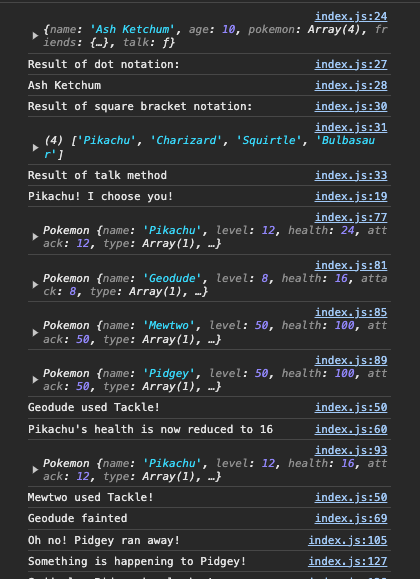
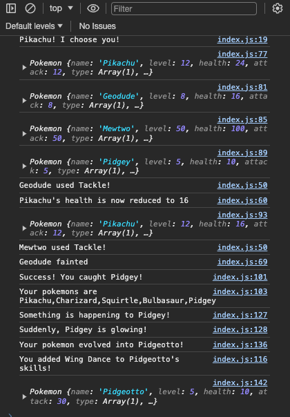

# JavaScript - Object
### Discussion Topic List
- Object Literals (5 mins)
- Object class (5 mins)
- "new" Keyword (5 mins)
- Constructor Function (15 mins)
- "this" keyword (5 mins)
- Instantiation (10 mins)
- Accessing using dot notation (5 mins)
- Adding properties (5 mins)
- Object Methods (5 mins)
- Real World Application (15 mins?)

Total: 75 mins

### Activity Topic List
#### Discussed
- Object Literals (5 mins)
- Constructor Function (15 mins)
- "new" Keyword (5 mins)
- Instantiation (5 mins)
- Accessing using dot notation (5 mins)
- Object Methods (20 mins)
### Researched
- Accessing using square brackets (5 mins)
- Object.prototype (10 mins)
- Adding properties (5 mins)
- Reassigning values (10 mins)
- Object Methods (30 mins)
- this Keyword (5 mins)
- Object.freeze() (5 mins)
Total: 120 mins

## Resources

### References
- [Code Commit Repository](https://ap-southeast-1.console.aws.amazon.com/codesuite/codecommit/repositories/ZCBCurricula_MCP_WDC028v3.0.0/browse?region=ap-southeast-1#)
- [Google Slide Presentation](https://docs.google.com/presentation/d/1IVzEJhsNZH7V9vtJapz2PfUN-wLR34W2PYRc2PuJWO0/edit#slide=id.ge4ee32738d_0_8)
- [JavaScript Objects (w3schools)](https://www.w3schools.com/js/js_objects.asp)
- [Working with Objects (MDN Web Docs)](https://developer.mozilla.org/en-US/docs/Web/JavaScript/Guide/Working_with_Objects)
- [Working With Objects](https://developer.mozilla.org/en-US/docs/Web/JavaScript/Guide/Working_with_Objects)
- [JavaScript Objects](https://developer.mozilla.org/en-US/docs/Web/JavaScript/Reference/Global_Objects/Object)
- [Object Literal Vs. Constructor In JavaScript](		https://medium.com/@mandeepkaur1/object-literal-vs-constructor-in-javascript-df143296b816)
- [JavaScript this Keyword](https://developer.mozilla.org/en-US/docs/Web/JavaScript/Reference/Operators/this)
- [Instance Definition](https://www.codemotion.com/magazine/Glossary/instance-computer-science/)
- [JavaScript new Operator](https://developer.mozilla.org/en-US/docs/Web/JavaScript/Reference/Operators/new)
- [Difference Between Object Literal and Instance Object](https://blog.kevinchisholm.com/javascript/difference-between-object-literal-and-instance-object/)
- [JavaScript Property Accessors](https://developer.mozilla.org/en-US/docs/Web/JavaScript/Reference/Operators/Property_accessors)
- [JavaScript delete Operator](https://developer.mozilla.org/en-US/docs/Web/JavaScript/Reference/Operators/delete)
- [General Method Definition](https://developer.mozilla.org/en-US/docs/Glossary/Method)
- [JavaScript Method Definition](https://developer.mozilla.org/en-US/docs/Web/JavaScript/Reference/Functions/Method_definitions)

### Tools/Technologies Version

## Code Discussion

### 1. Folder and File Preparation

#### batchfolder > individual > backend > s31 > discussion > index.html

```html
<!DOCTYPE HTML>
<html>
    <head>
        <title>JavaScript Objects</title>
    </head>
    <body>
        <script src="./index.js"></script>
    </body>
</html>
```

#### batchfolder > individual > backend > s31 > discussion > index.js
```js
console.log('Hello World');
```
### 2. Objects

An **object** is a **data type** that is used to represent real world objects

It is a **collection** of **related data** and/or functionalities

In JavaScript, most core JavaScript features like **strings** and **arrays** are objects (Strings are a collection of characters and arrays are a collection of data)

Information stored in objects are represented in a **"key:value"** pair

A **"key"** is also mostly referred to as a **"property"** of an object

Different data types may be stored in an object's property creating **complex data structures**


#### Creating objects using Object() class
- Object() is a built-in class in JavaScript that allows creation of an object
- The "new" operator signals creation of a new instance of the Object class that will be stored inside myComputer variable
- Instance refer to a copy of a blueprint that lets the developer create multiple copies of a class
#### batchfolder > groupwork > backend > s31 > discussion > index.js
```js
let myComputer = new Object();
console.log(myComputer)
console.log(typeof myComputer)
```

### Creating objects using object initializers/literal notation
This **creates/declares an object** and also **initializes/assigns it's properties** upon creation

A **cellphone** is an example of a real world object

It has it's **own properties** such as name, color, weight, unit model and a lot of other things
#### Syntax
    let objectName = {
        keyA: valueA,
        keyB: valueB
    }

#### batchfolder > individual > backend > s31 > discussion > index.js
```js
let cellphone = {
    name: 'Nokia 3210',
    manufactureDate: 1999
};

console.log('Result from creating objects using initializers/literal notation:');
console.log(cellphone);
console.log(typeof cellphone);
```

### Creating objects using a constructor function

Creates a **reusable function** to **create several objects** that have the same data structure

This is useful for **creating multiple instances/copies** of an object

An **instance is a concrete occurence** of any object which emphasizes on the distinct/unique identity of it
#### Syntax
    function ObjectName(keyA, keyB) {
        this.keyA = keyA;
        this.keyB = keyB;
    }

#### batchfolder > individual > backend > s31 > discussion > index.js
```js
let person = {
    firstName: 'John',
    lastName: 'Smith'
};
```

This is an object

The "this" keyword allows to assign a new object's properties by associating them with values received from a constructor function's parameters

#### batchfolder > individual > backend > s31 > discussion > index.js
```js
function Laptop(name, manufactureDate){
    this.name = name;
    this.manufactureDate = manufactureDate;
}
```
The "new" operator creates an instance of an object

Objects and instances are often interchanged because object literals (let object = {}) and instances (let object = new object) are distinct/unique objects

#### batchfolder > individual > backend > s31 > discussion > index.js
```js
// This is a unique instance of the Laptop object
let laptop = new Laptop('Lenovo', 2008);
console.log('Result from creating objects using object constructors:');
console.log(laptop);

// This is another unique instance of the Laptop object
let myLaptop = new Laptop('MacBook Air', 2020);
console.log('Result from creating objects using object constructors:');
console.log(myLaptop);

// no "new" keyword
let oldLaptop = Laptop('Portal R2E CCMC', 1980);
// Returns "undefined" without the "new" operator because the "Laptop" function does not have a return statement
console.log('Result from creating objects without the new keyword:');
console.log(oldLaptop);
```

### Accessing Object Properties

#### Using dot notation

#### batchfolder > individual > backend > s31 > discussion > index.js
```js
console.log('Result from dot notation: ' + myLaptop.name);
```

#### Accessing array objects

- By using the **dot notation**, this easily helps us **differentiate accessing** elements from **arrays and properties from objects**
- Object **properties have names** that makes it easier to associate pieces of information

#### batchfolder > individual > backend > s31 > discussion > index.js
```js
let array = [laptop, myLaptop];

// May be confused for accessing array indexes
console.log(array[0]['name']);
// Differentiation between accessing arrays and object properties
// This tells us that array[0], which is the first element, is an object by using the dot notation
console.log(array[0].name);
```

### Initializing/Adding/Deleting/Reassigning Object Properties
Like any other variable in JavaScript, **objects** may have their properties **initialized/added after the object was created/declared**

This is **useful** for times when an **object's properties are undetermined** at the time of creating them

#### batchfolder > individual > backend > s31 > discussion > index.js
```js
let car = {};

// Initializing/adding object properties using dot notation
car.name = 'Honda Civic';
console.log('Result from adding properties using dot notation:');
console.log(car);
```

### Initializing/adding object properties using object methods
While using the object methods will allow access to spaces when assigning property names to make it easier to read, this also makes it so that object properties can only be accesssed using the object methods

Dot notation is often preferred because it is easier to read, and less verbose.

#### batchfolder > individual > backend > s31 > discussion > index.js
```js
let person = {
    name: 'John',
    talk: function() {
        console.log('Hello my name is ' + this.name);
    }
}

console.log(person);
console.log('Result from object methods:');
person.talk();

// Adding methods to objects
person.walk = function() { 
    console.log(this.name + ' walked 25 steps forward.');
};
person.walk();

// Methods are useful for creating reusable functions that perform tasks related to objects
let friend = {
    firstName: 'Joe',
    lastName: 'Smith',
    address: {
        city: 'Austin',
        country: 'Texas'
    },
    emails: ['joe@mail.com', 'joesmith@email.xyz'],
    introduce: function() {
        console.log('Hello my name is ' + this.firstName + ' ' + this.lastName);
    }
};
friend.introduce();
```

### Real World Application Of Objects
Scenario
1. We would like to create a game that would have several pokemon interact with each other
2. Every pokemon would have the same set of stats, properties and functions

#### batchfolder > groupwork > backend > s31 > discussion > index.js
```js
console.log(myPokemon);
// Creating an object constructor instead will help with the process of creating multiple objects with the same structure
function Pokemon(name, level) {

    // Properties
    this.name = name;
    this.level = level;
    this.health = 2 * level;
    this.attack = level;

    //Methods
    this.tackle = function(target) {
        console.log(this.name + ' tackled ' + target.name);
        console.log("targetPokemon's health is now reduced to _targetPokemonHealth_");
        };
    this.faint = function(){
        console.log(this.name + 'fainted.');
    }
}
// Creates new instances of the "Pokemon" object each with their unique properties
let pikachu = new Pokemon("Pikachu", 16);
let rattata = new Pokemon('Rattata', 8);
// Providing the "rattata" object as an argument to the "pikachu" tackle method will create interaction between the two objects
pikachu.tackle(rattata);
```

## Activity

### Activity References
- [JavaScript Object.freeze()](https://developer.mozilla.org/en-US/docs/Web/JavaScript/Reference/Global_Objects/Object/freeze)
- [JavaScript Object.prototype](https://www.w3schools.com/js/js_object_prototypes.asp)
- [JavaScript this Keyword MDN](https://developer.mozilla.org/en-US/docs/Web/JavaScript/Reference/Operators/this#function_context)
- [JavaScript this Keyword W3Schools](https://www.w3schools.com/js/js_this.asp)


### Instructions

Member 1:
1. In the S31 folder, create an activity folder and an index.html and index.js file inside of it.
- Create an index.html file to attach our index.js file
- Copy the template provided by your Instructor and paste it in an index.js file.
- Update your local sessions git repository and push to git with the commit message of Add template code s31.
- Console log the message Hello World to ensure that the script file is properly associated with the html file.

2. Create a trainer object using object literals.
- Initialize/add the following trainer object properties:
- Name (String)
- Age (Number)
- Pokemon (Array)
- Friends (Object with Array values for properties)

3. Initialize/add the trainer object method named talk that returns the message Pikachu! I choose you!
4. Access the trainer object properties using dot and square bracket notation.
5. Invoke/call the trainer talk object method in a console.log() to display the value returned by the method.

Member 2:

6. Create a constructor function called Pokemon for creating a pokemon with the following properties:
- Name (Provided as an argument to the contructor)
- Level (Provided as an argument to the contructor)
- Health (Create an equation that uses the level property)
- Attack (Create an equation that uses the level property)
- Skills (Array with 1 default element)
7. Add a useSkill method for the pokemon constructor that will use a skill in the skills array of the pokemon.
- a target and a skill will be passed as arguments
- subtract the health property of the target pokemon object with the attack property of the object that used the useSkill method.
8. Create/instantiate several pokemon object from the constructor with varying name and level properties.

9. Add and a faint method for the pokemon constructor that will print out a message of targetPokemon has fainted.
10. Add a condition in the useSkill method that if the health property of the target pokemon object is less than or equal to 0 will invoke the faint method.
11. Invoke the useSkill method of one pokemon object to see if it works as intended.
- using dot notation and square bracket notation, access a skill in the skills array of the pokemon, pick a target pokemon, and pass them as the arguments for the method

Member 3:

12. Using Object.prototype, add another trainer method to catch a pokemon with low health
- this method will receive a pokemon as argument
- look up Object.prototype property
- if the pokemon has <=10 health, add it in the pokemon array of the trainer
- otherwise, it will run away from the battle

13. Invoke the catch method to see if it works as intended.

14. Using the same Object.prototype, add another method in the Pokemon constructor function to add a skill into the skills array.
- a new skill will be passed as argument
- the method will check if the skill is already in the skills array
- if not, using "this" keyword, it will add the skill in the array
- if it exists, print "<pokemon> already learned <skill>!"

Member 4:

15. Using the same Object.prototype, add another method in the Pokemon constructor function to allow the pokemon to evolve.
- new name, attack, type, and new skill will be passed as arguments
- print warnings that the pokemon is about to evolve using console.log
- using "this" keyword, add new values for the pokemon name and attack values
- check if the type is not in the pokemon's type array. if so, using "this" keyword and push method, add the type in the pokemon's type array
- using "this" keyword, invoke the pokemon's addSkill method to add a skill in its skills array.
- return the new object using "this" keyword.

16. create another variable that will store the result when a pokemon's evolve function is invoked

17. print the evolved pokemon to see if it has the updated information of the pokemon.

18. Create another object NPC using object literals with the following properties
- Name (String)
- Pokemon (String)

19. Use Object.freeze() to prevent the users from modifying and adding properties to the NPC object
- Look up Object.freeze()
- Invoke Object.freeze() and send the NPC object as parameters
- Change a property of the NPC object
- Print the details to see if the changes were implemented.

Member 5:

20. Debug the given code to allow the functions to properly receive and return the correct values and mimic the output.

- Check syntax of the given code.
- Check if the correct value is returned.
- Check the parameters and arguments.
- Check the if else statements
- Check the loop statements
- Check if the array methods used are correct.
- Check if the objects are being accessed properly.

All Members:

21. Check out to your own git branch with git checkout -b <branchName>

22. Update your local sessions git repository and push to git with the commit message of Add activity code s31.

23. Add the sessions repo link in Boodle for s31.

### Expected Output



### Solution

**activity/index.html**

```html
<!DOCTYPE HTML>
<html>
    <head>
        <title>Activity: JavaScript Objects</title>
    </head>
    <body>
        <script src="./index.js"></script>
    </body>
</html>
```

**activity/index.js**

```js
// console.log("Hello World");

// Create an object using object literals
let trainer = {};

// Initialize/add the object properties and methods

// Properties
trainer.name = 'Ash Ketchum';
trainer.age = 10;
trainer.pokemon = ['Pikachu', 'Charizard', 'Squirtle', 'Bulbasaur'];
trainer.friends = {
	kanto: ['Brock', 'Misty'],
	hoenn: ['May', 'Max']
}

// Methods
trainer.talk = function() {
	console.log('Pikachu! I choose you!');
	// return 'Pikachu! I choose you!';
}

// Check if all properties and methods were properly added
console.log(trainer);

// Access object properties using dot notation
console.log('Result of dot notation:');
console.log(trainer.name);
// Access object properties using dot notation
console.log('Result of square bracket notation:')
console.log(trainer['pokemon']);
// Access the trainer "talk" method
console.log('Result of talk method');
trainer.talk();

// Create a constructor function for creating a pokemon
function Pokemon(name,level, type) {

	// Properties
	this.name = name;
	this.level = level;
	this.health = 2 * level;
	this.attack = level;
	this.type = [type];
	this.skills = ["Tackle"]

	// Methods
	// Will accept an object as a target and the skill to be used
	this.useSkill = function(target, skill) {
		console.log(this.name + " used " + skill + "!");
	    // Reduces the target object's health property by subtracting and reassigning it's value the the pokemon's attack
	    target.health -= this.attack;
	    
	    // If the health of the target is less than or equal to 0
	    if (target.health <= 0) {
	    	// Invokes the faint method from the target object
	        target.faint()
	    } else {
	    	// Prints the target's name and message after it has been reassigned a different value
	    	console.log( target.name +"'s health is now reduced to " + target.health);
	    }

		return this;

	};

	// Method is invoked in the tackle method
	this.faint = function(){
	    console.log( this.name +" fainted");
	    // return this.name +" fainted"
	}

}

// Create/instantiate a new pokemon
let pikachu = new Pokemon("Pikachu",12, "Electric");
console.log(pikachu);

// Create/instantiate a new pokemon
let geodude = new Pokemon("Geodude", 8, "Rock");
console.log(geodude);

// Create/instantiate a new pokemon
let mewtwo = new Pokemon("Mewtwo", 50, "Psychic");
console.log(mewtwo);

// Create/instantiate a new pokemon
let pidgey = new Pokemon("Pidgey", 5, "Normal");
console.log(pidgey);

// Invoke the tackle method and target a different object
geodude.useSkill(pikachu, geodude.skills[0]);
console.log(pikachu);

// Invoke the tackle method and target a different object
mewtwo.useSkill(geodude, mewtwo.skills[0]);


trainer.catch = function(pokemon){
	if (pokemon.health <= 10){
		console.log("Success! You caught "+ pokemon.name + "!")
		trainer.pokemon.push(pokemon.name)
		console.log("Your pokemons are "+ trainer.pokemon)
	}else{
		console.log("Oh no! "+ pokemon.name + " ran away!")
	}
}
trainer.catch(pidgey)

// add a method inside the Pokemon that will allow the pokemon to add/replace skills array
Pokemon.prototype.addSkill = function(newSkill) {
	//check if the skill already exists
	if(this.skills.includes(newSkill) == false){
		// add the skill if it's not yet in the skills array
		this.skills.push(newSkill)
		console.log("You added " + newSkill + " to " + this.name + "'s skills!")
	}
	else{
		// print a message if the skill is already in the skills array
		console.log("This pokemon already has " + newSkill + "!")
	}
	return this;
}

// add method that will allow a pokemon to evolve. this will change the name of the pokemon as well as the attack value
Pokemon.prototype.evolve = function(newName, newAttack, newType, newSkill) {
	console.log("Something is happening to "+ this.name + "!")
	console.log("Suddenly, "+ this.name + " is glowing!")
    this.name = newName;
    this.attack = newAttack;
	// check if the pokemon's type is already in the type array
	if (!this.type.includes(newType)) {
	    this.type.push(newType);
	    console.log("Added " + newType + " to " + this.name + "'s type array!");
	}
	console.log("Your pokemon evolved into " + this.name + "!")
	this.addSkill(newSkill)
	return this;
}

let pidgeotto = pidgey.evolve("Pidgeotto", 30, "Normal", "Wing Dance");
console.log(pidgeotto);


//Do not modify
//For exporting to test.js
try{
    module.exports = {

        trainer: typeof trainer !== 'undefined' ? trainer : null,
        Pokemon: typeof Pokemon !== 'undefined' ? Pokemon : null

    }
} catch(err){

}
```