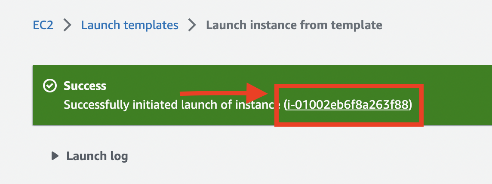

# Capstone 2 AWS Deployment (Instructor Guide)

We will utilize Amazon Web Services' Elastic Compute Cloud (EC2) service to set up a web server. Think of an **EC2 instance** as a virtual computer in the cloud. Additionally, AWS offers a service called Elastic IP (EIP) that provides a public IP address to our EC2 instance.

Our objective is to create an AWS Backend Server, which involves provisioning an EC2 instance with an associated public IP address. This setup allows direct access to the server from a web browser, as it contains all the required software to host a web application.


-----------------------------------------------------------------------------

## For Instructor prep

**NOTE to Instructor:**
This set up needs to be done by *Intructor* before the AWS hosting discussion.

-----------------------------------------------------------------------------
## PART 1 - Launch an EC2 Instance
-----------------------------------------------------------------------------

1. First step is to launch an instance. We'll host our WebServer instances in AWS's **us-east-2 (Ohio) region**, so make sure that upon logging in to AWS console your region is **Ohio**.


2. Go to **EC2 console**. Type **"ec2"** in the search bar and click the first link in the result under *Services*.


3. In launching our WebServer, we'll use a predefined **launch template**. In the navigation links of
the *EC2 console (left-hand side)*, click the link to **"Launch Templates"**.


4. From the table select row with Launch template name of **"JAABSWebServerTemplate"**. Then in the
*Actions* dropdown select **"Launch instance from template"**.


    **NOTES**

    - This template has preconfigured settings for a web server. It includes a "launch script" that will
    install necessary software.
    - The script also creates a user group named *bootcamper*. This will be used in the latter steps.
    - Software/packages installed in the instance


5. Under field *"Source template version"*, make sure that the **default** version is selected. Then, click the **"Launch Instance"** button.

**NOTES**
- Make sure you have a copy of the key-pair file: [zuitt_keypair_us_east2.pem](zuitt_keypair_us_east2.pem). 
	- Save the file to the .ssh folder of your current OS accounts.
		- For Windows, it will be in `C:\Users\username\.ssh` directory.
		- For Linux, it will be in `/home/username/.ssh` directory.
		- For MacOS, it will be in `~/.ssh` directory.


6. You will be prompted once launch is successful.




7. You can now navigate to the **Instances page**. In the navigation links of the EC2 console (left-hand side), click the link to **"Instances"**. Select the row of your instance. If you are having difficulties finding, you can type the instance ID in the search box. Once selected, check on the details tab. Information under this tab will be useful.


8. Change the instance's name for easier identification. Just click on the edit icon beside the instance's name and input your desired name in the text box and click the Save button.

    - You can change the name to **`b<batch_sid>-g<count_per_class>`** for easier tracking.
Example for Batch 270, you can rename it to b270-g1.


9. Go to **Instances** page and check the details of the instance. Copy the **Public IPv4 DNS** and Instance ID (You can simply click the copy icon).
    - For Public IPv4 DNS, Make sure that there is no "https://" at the beginning and a "/" at the end of the URL.


- The table below shows some the instance status and what they mean. For complete reference
of "Instance lifecycle", you may refer to this [link](https://docs.aws.amazon.com/AWSEC2/latest/UserGuide/ec2-instance-lifecycle.html).


| Instance state      | Description      | 
| --------- | --------- | 
| running  | The instance is running and ready for use.  | 
| stopped | The instance is shut down and cannot be used. The instance can be started
at any time.  | 
| terminated  | The instance has been permanently deleted and cannot be started.  |

10. Make a copy of all files needed using the templates [here](https://drive.google.com/drive/u/0/folders/12yYtJ9NS0x_WcACovpCmlgm2i7LvjdUH). Replace the [TEMPLATE] with the batch name. E.g. [B322]
11. Copy the **Public IPv4 DNS** and paste it into EC2 INSTANCE Public URL field in the spreadsheet. Make sure that there is no “https://” at the beginning and a “/” at the end of the URL.


12. Connect to the instance via SSH. You can copy the command from **Main usr**:


-----------------------------------------------------------------------------
## PART 2 -  SETTING UP THE APPSCRIPT FOR THE SEARCH APP
-----------------------------------------------------------------------------
*Note: This is useful so that the bootcamper will no longer always ask for their information regarding the CSP2 deployment if they forget them.*

1. Change the **BATCH SID** in cell B1 since this will be reflected in the web app. 
2. Open Extensions > App Script 

3. Create a new deployment

4. Set “Execute as” to “Me” and “Who has access” to “Anyone”, then deploy

5. Authorize access to our deployment and authorize with your Google Account


**Note: Sometimes it will warn you that the connection is not secure, just ignore that and continue to the page.**

6.  Deployment complete! You can now copy the URL and share it with your bootcampers so that they can access their own information by using their Email. The information includes SSH connection command, webhook URL, Deployed API link, etc.


**Example Search result:**


**Also, since the deployed URL is too long, you can also use a URL shortener for this one like [https://bitly.com/](https://bitly.com/) but this is optional.**


-----------------------------------------------------------------------------
## PART 3 - COLLECTING AND ADDING BOOTCAMPERS’ PUBLIC SSH KEY
-----------------------------------------------------------------------------

For this part, we will use the public keys that the bootcampers registered in their [git.zuitt](https://git.zuitt.co/) accounts. Make sure bootcampers have already an SSH key in their git.zuitt account. 

1. Connect to the instance you created in **PART 1** using the SSH command. 
2. In your home folder (`/home/ubuntu`), you'll find a folder named `scripts` then `user_management`. Change your directory to `user_management`.


```ubuntu
cd /home/ubuntu/scripts/user_management
```

3. Create a .csv using nano containing the emails of bootcampers that will use the instance.

```ubuntu
nano bootcampers.csv
```

Sample content of .csv file:

```csv
num,username
1,vince.tapang
2,paolo.misa
```
**NOTE: Usernames are listed under Git tab of Classes page in Boodle or in [git.zuitt](https://git.zuitt.co/)**

4. Run the script with the .csv file as argument.
```ubuntu
sudo ./manage.py bootcampers.csv
```


**Example if there's an error:**


-----------------------------------------------------------------------------
## PART 4 -  SETTING UP THE WEBHOOK HANDLER SERVER
-----------------------------------------------------------------------------

*Note: The webhook handler server is a simple ExpressJS app that is responsible for listening to any changes in the remote repository of the bootcamper as long as the bootcamper has already added their webhook URL in the project repository’s Webhook tab.*


*It is going to be triggered every time there are commits added to the remote repository of the bootcampers and it will run a redeployment script according to which bootcamper committed the changes.*

1. Execute the following commands in the home directory “~$” to download, install, and set up the webhook server automatically.

```sudo
cd ~
curl https://csp2-scripts.s3.us-west-2.amazonaws.com/v2.2/setup.sh | bash
```

2. Wait for a couple of minutes and if it is finished, this should be the output


3. Test the server connection by accessing the instance URL with the /webhook endpoint


**MONITOR YOUR SERVER IF IT IS RUNNING PROPERLY AND FOR DEBUGGING PURPOSES**

- To check the status of your application you can use the following command:

```
pm2 status
```

- To check the console logs of your application:

```
pm2 logs
```


- To restart the server:

```
pm2 restart webhook-server
```

- To stop the server

```
pm2 stop
```

- To delete the server

```
pm2 delete
```


-----------------------------------------------------------------------------
## For Bootcampers


#### Refer to [csp2-aws-bootcamper-guide.md](csp2-bootcamper-guide/csp2-aws-bootcamper-guide.md) for the next steps that will be performed for each **user/bootcamper**.

-	Feel free to duplicate the [csp2-bootcamper-guide](csp2-bootcamper-guide/) to your batch resources.
-	Teach the students how to open the .md file to their browser

**Install Markdown Preview Browser**

1. Press **Ctrl + Shift + P**
	-	Choose **Package Control: Install Package**

2. Search the Markdown and download it.

**To Open .md file using Markdown**

1. Press **Ctrl + Shift + P**
2. Search for and select **Markdown Preview: Preview in Browser**
3. Click **Markdown** to preview in browser.


### Capstone 2 Routes For Automated Grading

1. Create a new **[capstone2.json](./capstone2.json)** file in the capstone 2 folder/repo.


2. Copy the format of the **[capstone2-template.json](./capstone2-template.json)** into your Boodle notes or via a codesharing application.


3. Allow students to add their hosted links and routes for **Each Feature**. **MAKE SURE** to add the prefix to each routes per group such as this:


-----------------------------------------------------------------------------


