# CAPSTONE 2 - AWS DEPLOYMENT (BOOTCAMPER GUIDE)

-----------------------------------------------------------------------------
## PART 1 - CONNECTING TO REMOTE AWS SERVER INSTANCE
-----------------------------------------------------------------------------

1. Go to this link *{AppScript Web App given by your Instructor}* and search for your instance information by using your registered email. Then copy the command for connecting to the instance.

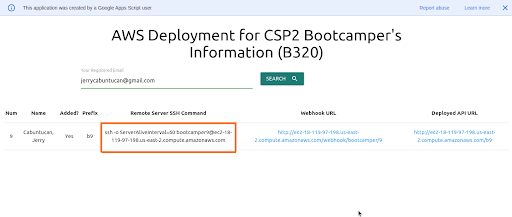

2. Open a terminal/git bash and paste the remote server connection command and press ENTER.

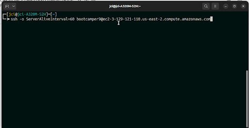

3. This should be the output after connecting.

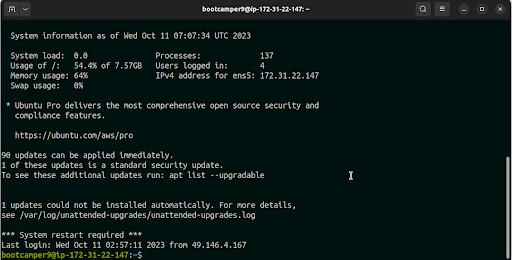

-----------------------------------------------------------------------------
## PART 2 - CLONE PROJECT REPOSITORY AND DEPLOY THE API
-----------------------------------------------------------------------------

1. **Add the ssh key of the instance to Zuitt Git.**
	-	Use the following command to generate and copy the ssh key

```sudo
csp2-sshkeygen
```

This should be the output:

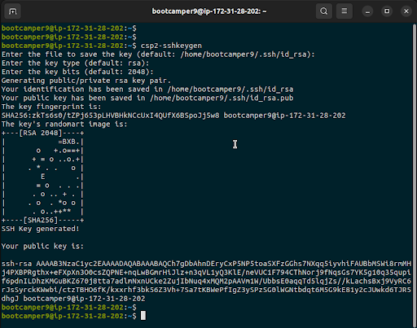

2. Copy the generated SSH

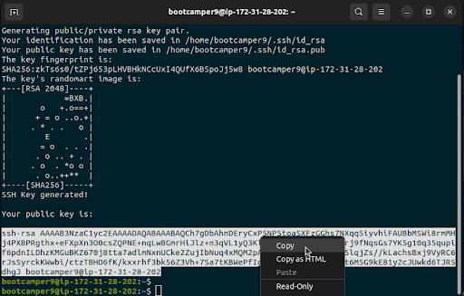


3. **Go to your Zuitt Git account and add the public ssh key to Settings.**
	-	Settings > SSH/GPG Keys > Add Key

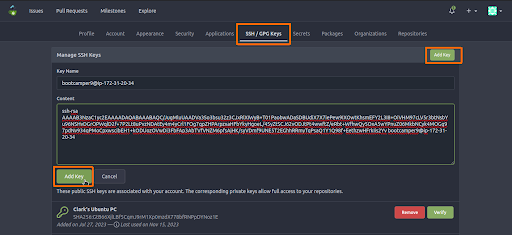


4. **Clone the CSP2 project repository to your remote server**
	-	Copy the ssh link of your repository

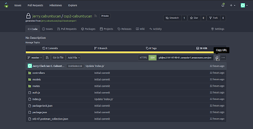


5. **Clone your repository to the remote server**

	-	example:
```sudo
git clone git@ec2-54-147-90-61.compute-1.amazonaws.com:jerry.cabuntucan/csp2-cabuntucan.git
```

This should be the output:

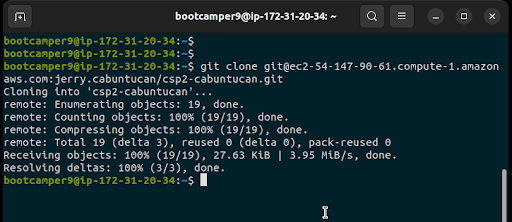

Type *ls* to see the folder.


6. **Start the deployment step.**
	-	Navigate through the folder and go to the capstone folder in the backend and type ls to see the contents of the folder, you should see your project files and folders.

	-	example:
```sudo
cd csp2-cabuntucan
```

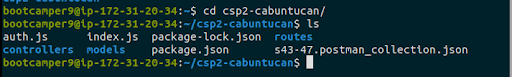


7. Inside your project directory, configure your server by executing the following command.

```sudo
csp2-deploy <prefix>
```

**Note that the <prefix> here pertains to the assigned prefix given to you.**

example:

```sudo
csp2-deploy b9
```

I used 9 since I am the bootcamper 9

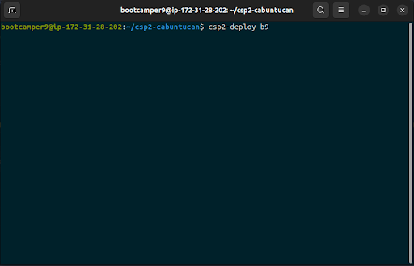

Then press enter and wait for a few minutes…

**This should be the output**

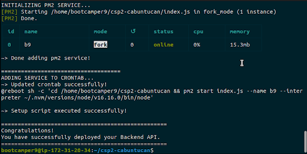


**And that’s done! You have successfully deployed your application. BUT.. to use our LIVE API URL we need to update our project’s index.js …**


-----------------------------------------------------------------------------
## PART 3 - UPDATING OUR PROJECT AND RE-DEPLOYING
-----------------------------------------------------------------------------
**NOTE:** As much as possible, we do not recommend re-deploying your app in production. Keep in mind that your app must be free of errors before deploying it in production. However, if you absolutely need to update your app, follow these steps.

1. Go to this link *{AppScript Web App}* and search for your instance information by using your registered email. Then copy the Webhook URL.

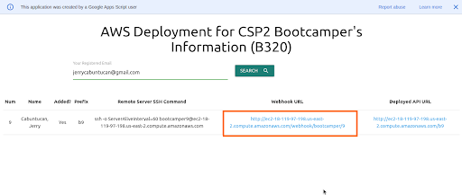


2. **Add the webhook URL to your csp2 project repository’s Webhooks tab**
	-	Settings > Webhooks > Add Webhook > Gitea

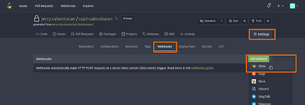


3. Add the URL to the “Target URL*”  field and save the webhook.


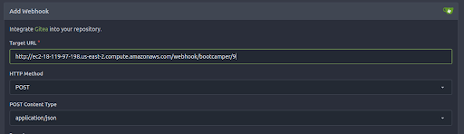
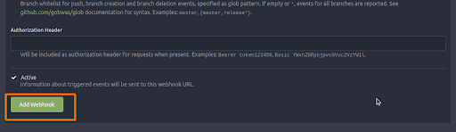


This should be the output

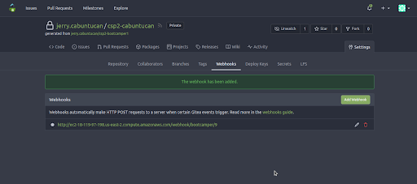

**IMPORTANT NOTE: Step 1 and step 2 should be done once only.**

*Note: The following steps can be used to re-deploy our application to our remote server everytime we add changes to our capstone project.*


4. **Make changes to your project.**
	-	Go to your project folder in Sublime Text editor and open index.js

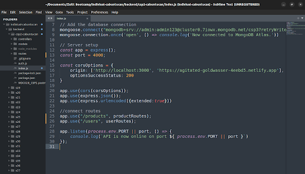


-	Update the following:
	-	**Port number** to the assigned port number.
	- 	**Main API routes** to use the prefix assigned to you

It should look like this

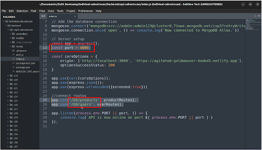


5. Commit and Push the changes to our remote repository.

6. Open your webhook URL in the browser to see the logs of the deployment to check if it was redeployed successfully.


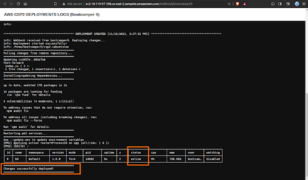

*NOTE: Since we set up our webhook in our project repository in Zuitt Git. Everytime we push changes to our project, it will automatically redeploy our application to the latest changes we committed.*


-----------------------------------------------------------------------------
== END ==
-----------------------------------------------------------------------------

**MONITOR YOUR SERVER IF IT IS RUNNING PROPERLY AND FOR DEBUGGING PURPOSES**
*NOTE: You need to connect first inside your AWS server instance.*

-	To check the status of your application you can use the following command:

```
pm2 status
```

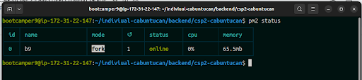

- 	To check the console logs of your application:

```
pm2 logs
```


- 	To restart the server: (note: change the <name> with the assigned prefix to you)

```
pm2 restart <name>
```

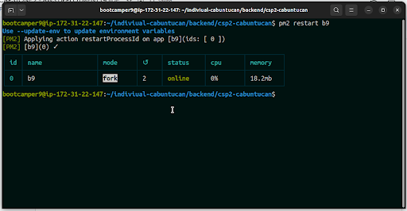


