# DevTools -  Introduction to DevTools

## Resources

### References


### Tools/Technologies Version
- N/A

## Code Discussion

### 1. Folder and File Preparation

- In the individual/frontend folder, create a new folder called s06.
- Inside the s06 folder, create a new folder called discussion.
- Inside the discussion folder, create a new folder called images.
- Inside the discussion folder, create a new file called index.html

### 2. Using Google Search and Documentation, Add a h1 element with an emoji
#### batchfolder > individual > s06 > discussion > index.js

- First add the HTML structure.

```html

    <!DOCTYPE html>
    <html lang="en">
    <head>
        <meta charset="UTF-8">
        <meta name="viewport" content="width=device-width, initial-scale=1.0">
        <link rel="icon" type="image/x-icon" href="/images/zuitt.png">
        <title>Dev Tools Introduction</title>
    </head>
    <body>
    
    </body>
    </html>

```

- Present the problem to the class: **Add an h1 element with the text My Cooking Profile and smile emoji.**.

- Analyze the problem. In this problem or objective, we are told to add an emoji with an h1 element. ***We already know how to add h1 element. So, let's add that first.***

```html

    <!DOCTYPE html>
    <html lang="en">
    <head>
        <meta charset="UTF-8">
        <meta name="viewport" content="width=device-width, initial-scale=1.0">
        <link rel="icon" type="image/x-icon" href="/images/zuitt.png">
        <title>My Cooking Profile</title>
    </head>
    <body>

        <h1>My Cooking Profile!</h1>
    
    </body>
    </html>

```
- Now, as we said in the slides discussion, the first step is to turn our problem in a question. We already have our h1, the only problem left is the emoji. 

- Let's turn our problem into a question:

    Add an emoji to an h1 element --> "How to add an emoji in html?"

- In Google or in a Search Engine, input our question:

    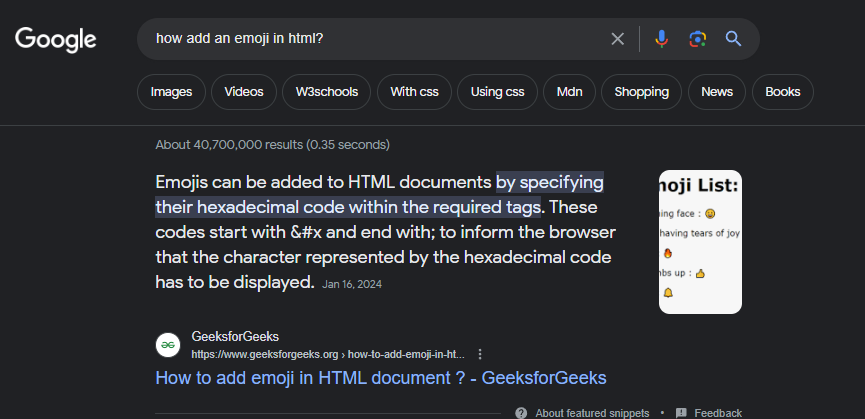

- Scan the results and Open the W3Schools result.*The first Result may not always be the best*

    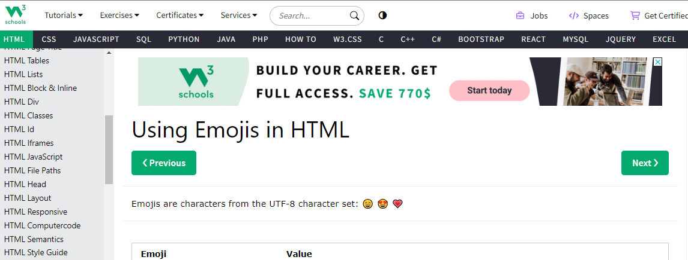

- Scan the documentation and briefly explain that emojis are characters that can be added to an html page as long as the <meta charset="UTF-8"> is added in the head has the correct value **"UTF-8"**

    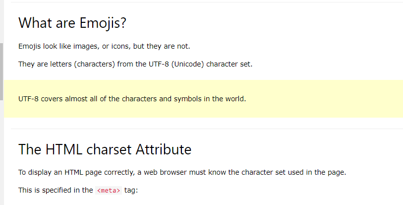

- Scroll further down or using the search bar (ctrl+f), look for "Emoji Characters". 

- Emoji Characters are added and behaves much like HTML Entities where we add the character number between an ampersand "&" and semicolon ";"

- Click on the tryit button to demonstrate.

    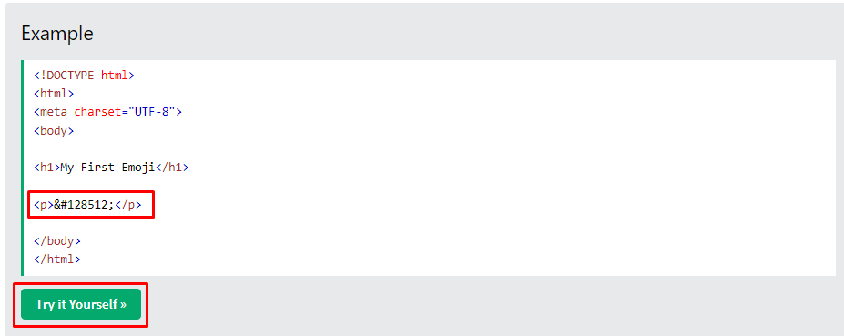

- An emoji created in html.

    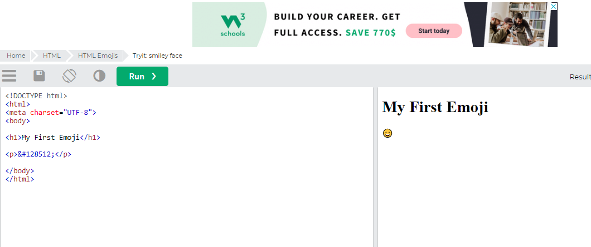

- Go back to the documentation and scroll down and look for the character code for a smile emoji. Copy the reference code below. *You can also point out more reference in the highlighted link*

    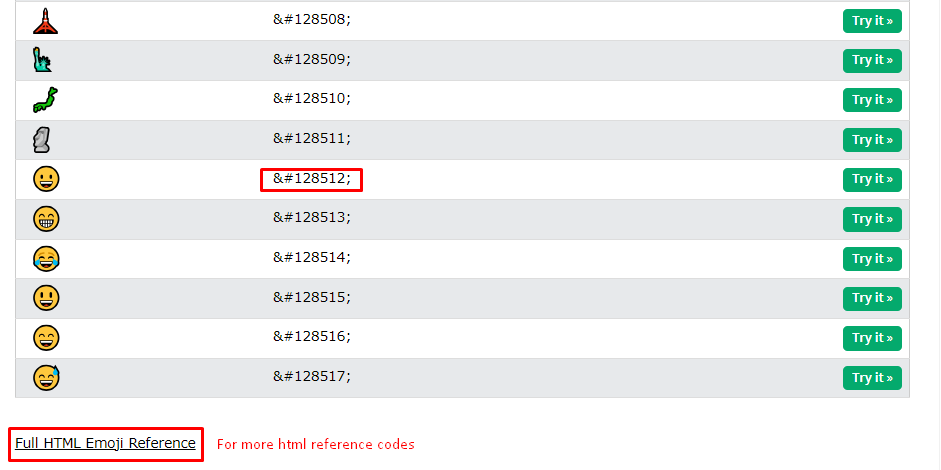

- Go back to the code and add your emoji.

```html

    <!DOCTYPE html>
    <html lang="en">
    <head>
        <meta charset="UTF-8">
        <meta name="viewport" content="width=device-width, initial-scale=1.0">
        <link rel="icon" type="image/x-icon" href="/images/zuitt.png">
        <title>Dev Tools</title>
    </head>
    <body>
        <h1>My Cooking Profile!&#128512;</h1>

    </body>
    </html>

```
- Check your output in the browser.

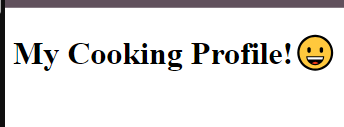

- As in our discussion, let's practice with a mini-activity (5 mins):

- Add an h3 with the text, "My Favorite Food"
- Add a div.
- Inside the div, Add 5 span elements. 
- In each element, add an emoji of your favorite food.
- Send a screenshot of your output in the Google Chat.

```html

    <!DOCTYPE html>
    <html lang="en">
    <head>
        <meta charset="UTF-8">
        <meta name="viewport" content="width=device-width, initial-scale=1.0">
        <link rel="icon" type="image/x-icon" href="/images/zuitt.png">
        <title>Dev Tools</title>
    </head>
    <body>
        <!-- Landing Header -->
        <h1>My Cooking Profile!&#128512;</h1>
        <h3>My Favorite Food</h3>
        <div>
            <span>&#127829;</span>
            <span>&#127835;</span>
            <span>&#127849;</span>
            <span>&#127846;</span>
            <span>&#127831;</span>
        </div>


    </body>
    </html>

```

### 3. Adding a Youtube Video in a webpage.
#### batchfolder > individual > s06 > discussion > index.js

- Let's add a Youtube Video in our webpage.

- First, let's center all the elements using the align attribute

- Then add another h3 and div for our youtube video

```html

    <!DOCTYPE html>
    <html lang="en">
    <head>
        <meta charset="UTF-8">
        <meta name="viewport" content="width=device-width, initial-scale=1.0">
        <link rel="icon" type="image/x-icon" href="/images/zuitt.png">
        <title>Dev Tools</title>
    </head>
    <body>
        <!-- Landing Header -->
        <h1 align="center">My Cooking Profile!&#128512;</h1>
        <h3 align="center">My Favorite Food</h3>
        <div align="center">
            <span>&#127829;</span>
            <span>&#127835;</span>
            <span>&#127849;</span>
            <span>&#127846;</span>
            <span>&#127831;</span>
        </div>
        <h3 align="center">My Favorite Recipe Video</h3>
        <div align="center">
            <!-- add youtube iframe -->
        </div>


    </body>
    </html>

```

- Present the objective: **Inside the div, add youtube video for your favorite recipe video.**

- Rephrase our problem/objective as a question: 
    - add youtube video for your favorite recipe video -> "How to add a youtube video in html?"

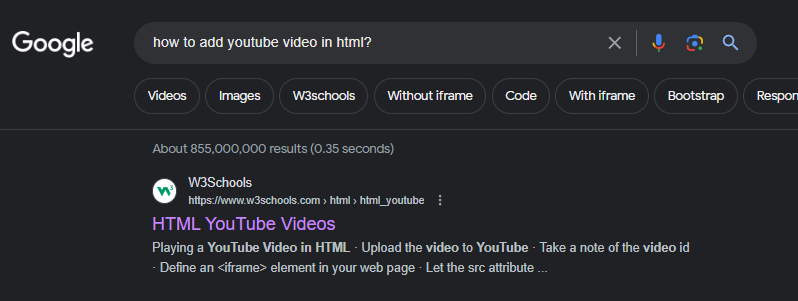

- Using Google Search, Sometimes the first result is not sufficient, let's scroll down and here we'll be able to find other sources, such as from Google itself.

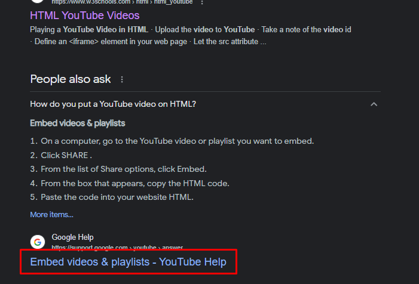

- Scroll down to find a step by step to embed youtube videos in html.

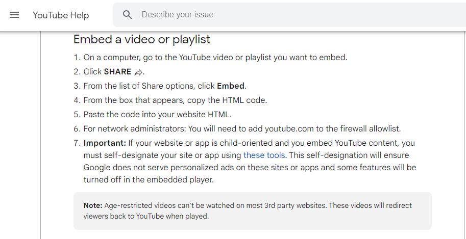

- Youtube is able to generate an iframe element where the youtube player can be played.

- Follow the step by step, go to youtube and search for a recipe video, 

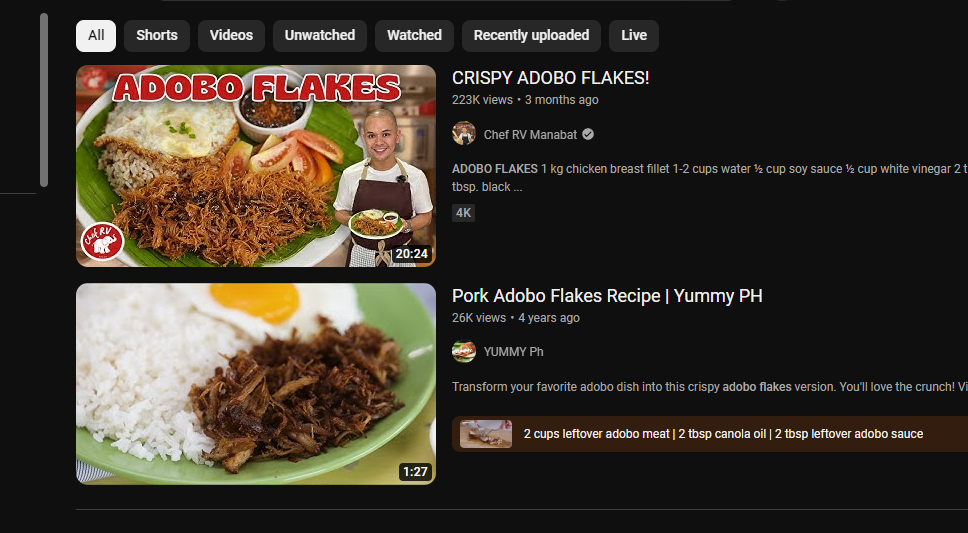

- Click on share and click on embed. 

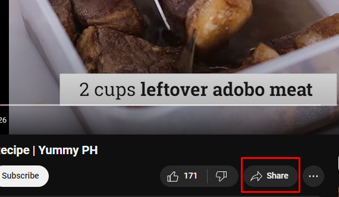
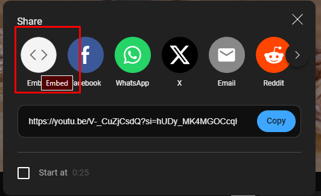

- Copy the given html code into your html file.

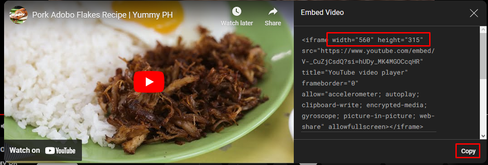

- Paste and modify accordingly in your own web page.

- iframes are elements that allows us to embed or add another web page, video player or even audio players into our page.

```html

    <!-- ... -->

        <!-- iframes can be resized using width and height attributes. -->
        <h3 align="center">My Favorite Recipe Video</h3>
        <div align="center">
            <iframe width="560" height="315" src="https://www.youtube.com/embed/V-_CuZjCsdQ?si=hUDy_MK4MGOCcqHR" title="YouTube video player" frameborder="0" allow="accelerometer; autoplay; clipboard-write; encrypted-media; gyroscope; picture-in-picture; web-share" allowfullscreen></iframe>
        </div>

    <!-- ... -->

```

- Check the page output:

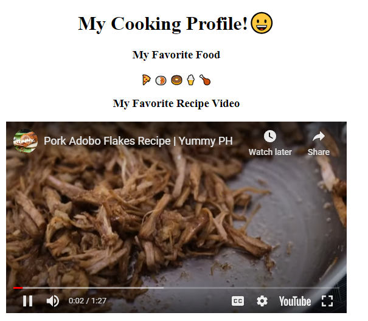


## Activity

### Activity References

- Activity focused on Research.

### Activity Instructions

- Type of Activity:
    - Coding
    - Individual

#### Instructions

1. In the s06 folder, create an activity folder and an index.html file.
2. [Research] - Add a nav element with id, navbar.
    - Center the element using the align attribute.
3. [Research] - Add a background color of your choice to the nav element.
    - **Note: Don't use CSS.**
4. Add 3 links inside. Home, About and Contact.
5. Add section with id, "landing"
    - Center the element using the align attribute.
6. Inside the landing section, add an h1,h3 and an image for your selected character.
7. Add section with id, "about"
8. Inside the about section, add an h3 and p to display details about the character.
9. Inside the about section, Embed a Youtube video about the character.
10. [Research] - Add a footer element with id, contact.
    - Center the element using the align attribute.
11. [Research] - Add a background color of your choice to the footer element.
12. Add paragraph elements for copyright and educational purpose disclaimers.
13. Add links to github,gitlab,linkedin and facebook.
    - Make sure to add images instead of text.
14. [Research] - Add an address element.
    - Add a fictional address within it.
15. Update your local individual git repository and push to git with the commit message of Add activity code s06.
16. Add the sessions repo link in Boodle for s06.

#### Activity Solution:
- Activity Solution can be found in : [activity/index.html](./activity/index.html)
