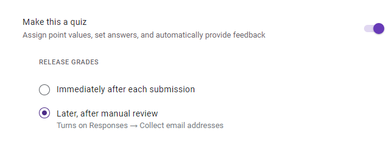

# Software Development Lifecycles

## Objectives
1. Demonstrate on how to do the following: 
	- Understand different SDLCs

## Lesson Proper

### (PT Batch) Skills Check for Dev Skills and Dev Tools Introduction
- [Google Slide Presentation](https://docs.google.com/presentation/d/1gt3ACYHqJ7Wm2OQ0cn_nMs48YGysAPfjmeAw0oMu9kM/edit?usp=drive_link)

### Discussion Proper
Browser > Google Slides

- [Google Slide Presentation](https://docs.google.com/presentation/d/1OgtR0jFAoa-wOXeHqIYLUYQX_vCnNBYsunL1Me_E5tI/edit#slide=id.g257c69c79f7_0_0)

## Activity

### Activity References

- Activity focused on Research.

### Activity Instructions

- Type of Activity:
    - Form Quiz
		- 
    - Individual

#### Instructions

1. Answer the given Google Form Quiz about SDLCs

#### Activity Solution:

1. Manually check the open ended questions using ChatGPT.
	- Scores are manually given after. Scores are released **after** checking.
	
2. Apply the following prompt:
	[activity/index.html](https://chat.openai.com/share/76455db1-68df-4491-911d-1e7ad7557e38)

- Activity Solution can be found in the google form quiz.