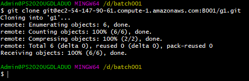

# Gitflow with Git
# Lesson Proper

## Resources

### References

Sample:

- [W3Schools](https://www.w3schools.com/html/default.asp)
- [Git](https://git-scm.com/docs)
- [Git Merge](https://www.atlassian.com/git/tutorials/using-branches/git-merge)
    
### Tools/Technologies Version

- Trello
- HTML - ^5.0.0
- Git - 2.31.1.windows.1

## Code Discussion

### 1. Folder and File Preparation

#### Following A Workflow

- Copy the given trello [trello board](https://trello.com/b/XorLrQ4h) in your group's workspace.

- **Assign the group leader** to the template upload task.

- **Assign the feature cards from feature list 1** to all team members.

- Have the group leader create a new **groupwork** folder in their batch folder separate from the **individual** repo.

- Inside, open git bash and initialize it as a git repo using `git init`.

- Create a new folder called ***frontend***. Inside the **frontend** folder create a new folder called **s09**.

- Inside **s09** folder create a new folder called **discussion** and **activity**. Inside the **discussion** folder, create a new file called index.html.

- Add the files for the commit using `git add .` and create a commit using `git commit -m "<commit message>"`.

- Connect the local repo to the online group repo using `git remote add origin <url>`

- The online repo should contain the group's **s09**.

#### Git Cloning

`git clone <url>` is a Git command used to create a copy of a remote repository onto your local machine, allowing you to work on the codebase locally.

- In the Group Members's batch folder, clone the group's repo. Open a terminal and clone the **group repo**. This will allow them to work on the codebase locally. Make sure it is not inside the individual repo.

- Then, rename the cloned folder as **groupwork**.

##### Complete the Feature Card Tasks

- Open the groupwork folder using sublime. Then, **add the feature** according to the group members assigned tasks from the Trello Board.

- Update the Trello cards from to do to doing and update the merge process tasks.

#### Git Branching
*You can also check the slides for the steps.*

#### Branch Creation 

The `git branch` command can be used to check the branches available for repo. By default, using git init creates the master branch in Windows, main branch in MacOs.

- The `git checkout -b <nameOfBranch>` command creates a copy of the master branch at that point in code creation and names it to the branch name specified.

- Create a new branch named after the feature you have added. In a git workflow, this is done to organize branches in the context of tasks.

#### Moving Between Branches

- `git checkout -b <nameOfBranch>` allowed us to create a new branch and move from master to the new branch.

- To be able to go back to the **master** branch, we use the `git checkout <master>` command.

The syntax for the branch command is `git checkout <target-branch>`.

#### Pushing To A Branch

- Push your updates as a new branch in your groups' repo using the same commands, git add, commit and push. However **instead of pushing to master**, we push to the **branch** as follows:

## Zuitt Git Pull Requests

Zuitt Git Pull Requests are merge requests that and allows merging of the content of two different branches into a single branch.

Consider the following scenario:

- User 1 works on the portfolio's navigation bar.
- At the same time, user 2 works on the portfolio's footer.
- Both of the users push their work in remote repository.

How would the remote repository reconcile changes? Answer: A Pull request

It allows merging of different sources into Zuitt Git's remote repository.

### Merging With A Group

**Instructor's Notes:** 

	- Choose a group to guide and have their leader share their screens.
	- Remind bootcampers that Group Leader Role will be changed every week so that everyone will have a chance to merge.
	- Remind Group Leaders to assist New Group Leaders in Merging.
	- ONLY ONE MEMBER MUST MERGE COMMITS TO AVOID CONFUSION.

1. In your Group Repo, click the branches link and there will be multiple feature branches, and a pull request can be made.

2. Create a pull request by clicking "New Pull Request".

3. You can skip the other details and scroll down and hit "Create Pull Request".

4. Going to the Pull Requests Tabs will display all available and pending Pull Requests. Select a pull request and view its details. 

- Merge the branches if there are no conflicts found and Click the "Commit Merge" button.

- The branch should now say merged.

- Even the commit histories of the branches should be merged.

- Check the code in master branch and our navbar should now be in the file

5. Select another branch and create a pull request. If there is a **Merge conflict**, we will have to resolve it locally using our sublime text, gitbash and vim (a CLI Code Editor)

	- **How does a Merge Conflict occur?**
		- It occurs when a branch is being attempted to be merged into another with a Pull Request, however git found that there were changes in the same files and in the same lines.
		- In this example the navbar is on the same line in the master branch but a new branch is being merged with updated content on the same lines.

- Upon checking the details of the pull requests, there should be a conflict.

6. Copy the command line instructions from the pull request.

7. Open your gitbash in your group repo and paste the commands. Press enter.

- This message must appear for us to resolve the conflict

8. Open your sublime text to the folder where the conflict is identified. You can see that there are now special symbols in Sublime, indicating local merge conflict resolve using Sublime.

9. Open the file and delete the HEAD, <<<<<<<, >>>>>>, ====== and Hash commit. This is called a manual review. 
	- The group leader can then update the code and save. 
	- This allows the group leader to re-arrange the file as needed.

	- Codes between the word "HEAD" and "=============" are the current codes in master. 
	- Codes between "=============" and >>>>>>>>>> "commit hash" are the new codes being added into the file.

- Save the file changes

10. Add the changes made using `git add .`

- Add the following command `git merge --continue` to continue and commit changes. 

- Close the editor that will open. If it's Sublime, simply close the editor.

- IF it's Vim like the one below, use `:q`

11. Add the command `git push`. There should be a fatal error. 

- We can continue by doing the command presented for set upstream.

12. Return to the pull request and there should be no longer a conflict. We can then continue to merge our commit.

13. Once a merge is made, The merger should checkout to master using `git checkout master`

14. Sync your local repo to the online repo's additions and changes using `git pull origin master`.

**Note: AS the merger, Always pull your master branch if there are merges.**

#### Pulling

**Pulling** is a process of updating data of a local repository from a remote repository.

This is usually done when two parties are working with the same repository using the following workflow:

1. Local repo 1 pushes the code to the remote repository
2. Local repo 2 pulls the code from remote repository containing changes from local repo 1
3. Local repo 1 --(push)--> Remote repo --(pull)--> Local repo 2

This syncs any changes done on the remote repository to the local repository.

It is a best practice to be able to pull from the master branch whenever a branch has been merged.

This way, merge conflicts can be lessened.

- After merging all branches, allow everyone to pull from the master branch using `git pull origin master`.

#### When to Use Pull and Clone

- **Cloning** is used if there is not local repository that exists yet in the device. It creates a *new copy* from the remote repository to the local repository. 

- **Pulling** is used if there is already an existing local repository and it is to be synced with the contents of the remote repository.

## Continue Practice

- **Assign the feature cards from feature list 2** to all team members.

- Before anything else, checkout back to master.

- Back in your sublime/IDE, **add the feature** in the code.

- Create a new branch using `git checkout -b <branchName>` for your new feature. This will allow us to have more organization.

- Add, commit and push your changes to your feature branch.

- Wait for the Group Leader to merge all branches.

- Then pull from master to sync with the master branch.

### Activity

1. Copy the given Trello Board.
2. Discuss and assign the members to each task.
	- Use Discord to communicate and discuss
	- No Lorem Ipsum as text.
3. Complete each task accordingly.
	- Edit and move the Trello Cards in their appropriate lists.
4. Review and Merge branches accordingly.
	- Once your task and feature is done and merge accepted, edit and move Feature Card.
	- Link your group’s git repo to Boodle as s09

Activity Solution:

[Activity Solution](./activity/index.html)
