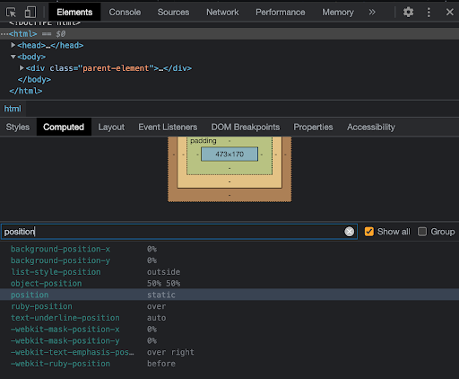

# CSS Common Positioning Properties 

# References
- []()

# Code Discussion

1. Folder and File Preparation

**batchfolder > individual > s13 > discussion > index.html**

Create a file named **index.html** inside the **discussion** folder.

2. Inside the index.html file, add the following:

**batchfolder > individual > s13 > discussion > index.html**

```html
<!DOCTYPE HTML>
<html>
    <head>
        <title>CSS Common Positioning Properties</title>
    </head>
    <body>
    </body>
</html>
```

3. Add the following to our index.html to demonstrate the use of position property:

### Positioning Properties

**batchfolder > individual > s13 > discussion > index.html**

```html
<!DOCTYPE HTML>
<html>
    <head>
        <title>CSS Common Positioning Properties</title>
    </head>
    <body>
        <h2>CSS Positioning</h2>
        <h3>Float</h3>

        <p>
        The float property is used for positioning Properties and formatting content e.g. let an image float left to the text in a container.
        </p>

        <p>
        
        Lorem ipsum dolor sit amet consectetur, adipisicing elit. Autem, exercitationem eveniet pariatur impedit. Architecto quasi itaque, accusantium tenetur. Incidunt, aperiam, reprehenderit. Repudiandae, culpa eos nulla odio. Odio perferendis, accusamus ad. Lorem ipsum dolor sit amet consectetur adipisicing elit. Blanditiis inventore numquam quia, accusantium modi, voluptate assumenda architecto, dicta laboriosam sit sequi perspiciatis quo ab soluta consequuntur, incidunt totam. Tempore, perspiciatis. Lorem ipsum dolor sit amet consectetur, adipisicing, elit. Incidunt amet asperiores omnis architecto delectus dolorum, temporibus cumque optio, quidem. Praesentium eum, qui vel dolorem fugit nemo, consectetur necessitatibus. Sapiente, doloremque?
        </p>

    </body>
</html>
```

### Float

What is float?

CSS Float is a property that allows elements to be positioned horizontally within their parent container. When an element is floated, it is removed from the normal flow of the document and positioned either to the left or right of its container. Other content can then flow around the floated element, creating a text wrap effect.

Imagine you have a bunch of images and you want to align them side by side. By applying the CSS Float property to each image, you can make them float to the left or right, and the text or other content around them will wrap around accordingly.

It's like placing a floating object on water—other objects (text or elements) will adjust their position to make space for the floated element.

### Add the following code in **index.css**

**batchfolder > individual > s13 > discussion > index.css**

```css
/*Float property*/

.img-float {
    width: 250px;
    height: 250px;
/*Try different values: left, right*/
    float: inherit;
}
```

**IMPORTANT NOTE:**
- However, it's important to note that CSS Float has some quirks and can sometimes lead to unintended layout issues, especially when not used carefully. Other modern CSS techniques like Flexbox and Grid have become more popular for creating complex layouts.

### Add the following code in **index.html**:

**batchfolder > individual > s13 > discussion > index.html**

```html  
<body>
    /…/

        <div class="parent-element">
        Parent Element
            <div class="child-one">
                I'm the child one element.
            </div>
            
            <div class="child-two">
                All eyes on me. I am the child two element.
            </div>
            
            <div class="child-three">
                I'm the child three element.
            </div>
        </div>

</body>
```

### Add Styling:
```css
.parent-element {
    background-color: skyblue;
    padding: 10px;
}


.child-one {
    background-color: gray;
    padding: 10px;
}

.child-two {
    background-color: yellow;
    padding: 10px;
}

.child-three {
    background-color: gray;
    padding: 10px;
}
```

**IMPORTANT NOTE:**
- You can check it by opening the dev tools and search filter position.
Go to Elements > Computed > Check Show All > Search in filter: position




- The left, right, top, and bottom properties do not affect an element with position: static.

### Add position: static to the div with the class child-two and left, top values to it:

**batchfolder > individual > s13 > discussion > index.css**

```css
.child-two {
    background-color: yellow;
    padding: 10px;
    position: static;
    left: 10px;
    bottom: 10px;
    
}
```

**IMPORTANT NOTE:**
- This confirms the fact that the left and bottom properties do not affect an element with position: static.

### Relative value

- relative remain in the normal flow of the document. But, unlike static elements, the left, right, top, bottom, and z-index properties affect the position of the element. An offset, based on the values of left, right, top, and bottom properties, is applied to the element relative to itself.

### Replace position: static with position: relative in our example:

**batchfolder > individual > s13 > discussion > index.css**

```css
.child-two {
    background-color: yellow;
    padding: 10px;
    position: relative;
    left: 10px;
    bottom: 10px;
    
}
```

**IMPORTANT NOTE:**
- Notice that the left and bottom properties now affect the position of the element. Also notice that the element remains in the normal flow of the document and the offset is applied relative to itself.

### Absolute value
- Elements with position: absolute are positioned relative to their parent elements. In this case, the element is removed from the normal document flow. The other elements will behave as if that element is not in the document. No space is created for the element in the page layout.

### Change the position of the child-two element to position: absolute:

**batchfolder > individual > s13 > discussion > index.css**

```css
.child-two {
    background-color: yellow;
    padding: 10px;
    position: absolute;
    left: 10px;
    bottom: 10px;
    
}
```

**IMPORTANT NOTE**
- The values of left, top, bottom, and right determine the final position of the element.
- As you can see in our output, the child-two element is at the bottom of our webpage.
- One thing to note is that an element with position: absolute is positioned relative to its closest positioned ancestor. That means that the parent element has to have a position value other than position: static.
- If the closest parent element is not positioned, it is positioned relative to the next parent element that is positioned. If there's no positioned ancestor element, it is positioned relative to the <html> element.

### Give the parent element a relative position so that it does not get positioned relative to the <html> element.

**batchfolder > individual > s13 > discussion > index.css**

```css
.parent-element {
    background-color: skyblue;
    padding: 10px;
    position: relative;
    height: 100px;
}
```

### Change the child-two class with top: 0:

**batchfolder > individual > s13 > discussion > index.css**

```css
.child-two {
    background-color: yellow;
    padding: 10px;
    position: absolute;
    top: 0;  
}
```

**IMPORTANT NOTE:**
- Notice that no space was created in the document for the element. The element is now positioned relative to the parent element.

### Fixed value

- Fixed-position elements are similar to absolutely positioned elements. They are also removed from the normal flow of the document. But unlike absolutely positioned elements, they are always positioned relative to the <html> element.
- One thing to note is that fixed elements are not affected by scrolling. They always stay in the same position on the screen.

### Change the position of child-two class into fixed:

**batchfolder > individual > s13 > discussion > index.css**

```css
.child-two {
    background-color: yellow;
    padding: 10px;
    position: fixed;
    left: 10px;
    bottom: 10px;
    
}
```

### Add height property in HTML element:

**batchfolder > individual > s13 > discussion > index.html**

```css
html {
    height: 800vh;
}
```

**IMPORTANT NOTE:**
- In this case, the element is positioned relative to the <html> element. Try scrolling to see that the element gets fixed on the screen.

### Sticky value
- position: sticky is a mix of position: relative and position: fixed. It acts like a relatively positioned element until a certain scroll point and then it acts like a fixed element.

### Change the position of child-two class into sticky:

**batchfolder > individual > s13 > discussion > index.css**

```css
.child-two {
    background-color: yellow;
    padding: 10px;
    position: sticky;
    top: 10px;
}
```

### Add height in parent-element.

**batchfolder > individual > s13 > discussion > index.css**

```css
.parent-element {
    background-color: skyblue;
    padding: 50px 10px;
    position: relative;
    height: 800vh;
}
```

### Z-index property

- Z-index is also belongs to the position like top, left, right and bottom.

### Create HTML elements to demonstrate the Z-index property

**batchfolder > individual > s13 > discussion > index.html**

```html
<hr>

    <h2>Z-index Example</h2>

    <p>An element with greater stack order is always above an element with a lower stack order.</p>

    <div class="container">
        <div class="black-box">Black box (z-index: 1)</div>
        <div class="gray-box">Gray box (z-index: 3)</div>
        <div class="green-box">Green box (z-index: 2)</div>
    </div>

```

**batchfolder > individual > s13 > discussion > index.css**

```css
/*Z index*/

.container {
  position: relative;
}

.black-box {
  position: relative;
  z-index: 1;
  border: 2px solid black;
  height: 100px;
  margin: 30px;
}

.gray-box {
  position: absolute;
  z-index: 3; /* gray box will be above both green and black box */
  background: lightgray;
  height: 60px;  
  width: 70%;
  left: 50px;
  top: 50px;
}

.green-box {
  position: absolute;
  z-index: 2; /* green box will be above black box */
  background: lightgreen;
  width: 35%;
  left: 270px;
  top: -15px;
  height: 100px;
}
```

**IMPORTANT NOTE:**
- Add the z-index value according to the stack order.

# Activity:

Instructions that can be provided to the students for reference:

## Activity References:
- [CSS Sticky Position](https://www.w3schools.com/css/css_positioning.asp)
- [CSS Top](https://www.w3schools.com/cssref/pr_pos_top.php)
- [CSS Position Relative](https://www.w3schools.com/css/css_positioning.asp)
- [CSS Left Property](https://www.w3schools.com/cssref/pr_pos_left.php)
- [CSS Z-Index](https://www.w3schools.com/css/css_z-index.asp)
- [CSS Float](https://www.w3schools.com/css/css_float.asp)
- [CSS Background Overlay over Background Image](https://css-tricks.com/tinted-images-multiple-backgrounds/)

## Activity:

**Member 1:**

1. In the s13 folder, create an activity folder and clone the template.html given by your instructor.
- Copy the template provided by your Instructor and paste it in the in the index.html file.
- Create an index.css file.
- Update your local groupwork git repository and push to git with the commit message of Add template code s10.
2. Add CSS Reset
3. Add google font family 'Open Sans' for all elements in the page.
4. Apply styling for all buttons in the page:
    - Apply white text color.
    - Add at least 10px padding on all sides.
    - Add width at least 9 times the root element font-size.
    - Increase font size.
    - Increase font-weight.
    - Add border-color as transparent
    - Add 25px border-radius

**Member 2:**

5. Apply styling for the nav element:
    - Add padding on all sides.
    - Add position as sticky.
    - Add top as 0
    - Add z-index as 1
    - Add a white background color.
6. Move the element with class “right-nav” to the right side.
        - Use the float property to float the element to the right side.
7. Select all li elements in the nav:
    - Remove the bullet points.
    - Display the li beside each other but still allows us to add width or height.
8. Select elements with class “nav” and “nav-logo”:
    - Add a margins on all sides.
    - Add padding on all sides.

**Member 3:**

9. Select the element with id “logo”:
    - Add padding at the top side.
    - Add padding at the left side.
10. Select the element with id “nav-button”
     - Set background color as  #c2195b;
11. Select the element with id “bg-image”
    - Add a linear-gradient of semi-transparent black using rgba.
    - Add background image with the following url:
        - "https://d3ojsfl21hfxhc.cloudfront.net/assets/zuitt/programdetails2_w.jpg"
    - Set the background to avoid repeat.
    - Set background size to cover.
    - Set the background position to center.
    - Add a padding at the top and bottom.
    - Set the font color to white.

**Member 4:**

12. Select the element with class “container”
    - Set text-alignment to right.
    - Set width to 40%.
    - Use CSS positioning properties to move the element to the right.
    - You can use position:relative; and left properties.
13. Select the element with class “title”:
    - Set the font to Zilla Slab.
    - Increase the font-size.
    - Increase the the font-weight.
14. Select the element with class “subtitle”
    - Increase the font-size.
    - Increase the font-weight.
    - Set the width to 75% of its parent’s width
    - Set the auto margin on the left-side
    - Set a margin on the top side.
15. Select the element with id “apply-button”
    - Add a margin at the top
    - Set background color as  #c2195b;

**Member 5:**

16. Select the element with id “main”
    - Add a padding at the top side.
    - Align the text to center.
17. Select the element with class “title-2”
    - Set the font to Zilla Slab.
    - Increase the font-size.
    - Increase the font-weight.
18. Select elements with class “description”:
    - Set margins at the top and bottom sides of the element.
    - Increase the font-weight.
19. Select the footer element:
    - Add a margin at the top side of the element.
    - Add a padding on all sides.
    - Align the text to the center.
20. Select the spans inside the footer:
    - Add margins at the right and left side of the element.
    - Increase the font weight.

**All Members:**

21. Check out to your own git branch with git checkout -b <branchName>
22. Update your local groupwork git repository and push to git with the commit message of Add activity code s13.
23. Add the sessions repo link in Boodle for s13.

# Solution:

1. Provide the HTML template.

**batchfolder > groupwork > s13 > activity > index.html**

```html
    <!DOCTYPE HTML>
    <html>
        <head>
            <title>Activity CSS Styling Properties and Positioning</title>

            <!-- External CSS -->
            <link rel="stylesheet" href="./index.css"/>

            <!-- Google Fonts -->
            <link rel="preconnect" href="https://fonts.googleapis.com">
            <link rel="preconnect" href="https://fonts.gstatic.com" crossorigin>
            <link href="https://fonts.googleapis.com/css2?family=Open+Sans:wght@300;400&family=Zilla+Slab:wght@300;400;500;600&display=swap" rel="stylesheet">

        </head>
        <body>

            <nav>
                <ul>
                    <li class="nav-logo">
                        
                    </li>
                    <div class="right-nav">  
                        <li class="nav">Home</li>
                        <li class="nav">Bootcamp Program</li>
                        <li class="nav">Companies</li>
                        <li class="nav">Bootcamp FAQ</li>
                        <li class="nav">Blog</li>
                        <li class="nav">
                            <button id="nav-button">APPLY NOW</button>
                        </li>
                    </div>
                </ul>
            </nav>


            <!-- landing page -->
            <section id="bg-image">
                <div class="container">
                    <h1 class="title">Our Training Options That Fit Your Coding Needs</h1>
                    <h2 class="subtitle">
                        Offering a workable and carefully curated curriculum to cater to a variety of students and equip them the necessary web development skills they need to become a coding literate.
                    </h2>
                    <button id="apply-button">Apply Now</button>
                </div>
            </section>
            <!-- end of landing page -->
            <!-- main section -->
            <section id="main">
                <h2 class="title-2">What is a Developer Career Program?</h2>
                <p class="description">
                    The Developer Career Program is inclusive of in-depth modules on static and dynamic web applications, with emphasis on the development of well-designed integrated software. The course covers key concepts on full-stack web development, including Responsive Web Design, Rapid Prototyping and Product Deployments.
                </p>       
                <h2 class="title-2">STILL HAVE A QUESTION?</h2>
                <p class="description">
                    Our career advisors are here to answer any questions you may have. Meet with them by booking one of our free seminars, and learn all the finer details of our web development course.
                </p>
                <button id="book-button">Book Now</button>
            </section>
            <!-- end of pre-footer section -->
            <!-- footer -->
            <footer>
                <!-- Creates an inline element -->
                <span>Terms of Service</span>
                <span>|</span>
                <span>Privacy Policy</span>
                <span>|</span>
                <span>&copy; 2022 Zuitt. All Rights Reserved</span>
            </footer>
            <!-- end of footer -->


        </body>
    </html>
```
 
2. Check the CSS Solution.

**batchfolder > groupwork > s12 > activity > index.css**

```css
/*===============CSS Reset===============*/
* {
    margin: 0;
    padding: 0;
    box-sizing: border-box;
    font-family: 'Open Sans', sans-serif;
}

/*===============General===============*/
button {
    color: white;
    padding: 10px;
    width: 9rem;
    font-size: 1rem;
    font-weight: 600;
    border-color: transparent;
    border-radius: 25px;
}

/*===============nav section===============*/
nav {
    padding: 3px;
    position: sticky;
    top: 0;
    background-color: white;
    z-index: 1;
}

.right-nav {
    float: right;
}

nav ul li {
    list-style-type: none;
    display: inline-block;
}

.nav, .nav-logo {
    margin: 0.5rem;
    padding: 3px;
}

#nav-button {
    background-color: #c2195b;
}

#logo {
    padding-top: 8px;
    padding-left: 5px;
}

/*===============landing page section===============*/
#bg-image {
    background: 
        linear-gradient(rgba(0, 0, 0, 0.5), rgba(0, 0, 0, 0.5)),
        url("https://d3ojsfl21hfxhc.cloudfront.net/assets/zuitt/programdetails2_w.jpg")
    ;
    background-repeat : no-repeat;
    background-size: cover;
    background-position: center;
    padding: 3rem 0;
    color: white;
}

.container {
    text-align: right;
    width:40%;
    position: relative;
    left: 55%;
}

.title {
    font-family: "Zilla Slab",serif;
    font-size: 2.5rem;
    font-weight: 600;
}

.subtitle {
    font-size: 1.3rem;
    font-weight: 300;
    width: 75%;
    margin-left: auto;
    margin-top: 1em;
}

#apply-button {
    margin-top: 1em;
    background-color: #c2195b;
}

/*===============main section===============*/
#main {
    padding-top: 75px;
    text-align: center;
}

.title-2 {
    font-size: 2rem;
    font-family: "Zilla Slab",serif;
    font-weight: 600;
}

.description {
    margin: 3rem 0;
    font-weight: 300;
}

#book-button {
    background-color: #336589;
}

/*===============footer section===============*/
footer {
    /*creates space between the span tags and the footer border*/
    margin-top: 1.5rem;
    padding: 1rem;
    text-align: center;
}

footer span {
    /*creates space horizontally between span tags*/
    /*best to use equal measurement on both sides for horizontal alignment.*/
    margin-left: 0.5rem;
    margin-right: 0.5rem;
    /*margin: 0 0.5rem;*/
    font-weight: 300;
}

```