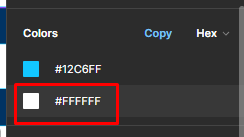

# Wireframes, Mockups, and Prototypes

# Session Objectives

At the end of the session, the students are expected to:

- Define what wireframes, mockups, and prototypes are
- Learn how to create wireframes, mockups, and prototypes in Figma
- Generate mockups for a single page
- Translate mockups to prototypes quickly

# Resources

## Instructional Materials

- [Google Slide Presentation](https://docs.google.com/presentation/d/1W-46tfHahnKGGGGQc9QOU3l_IzUW4qMgSNLQGRFCqno/edit#slide=id.g20386e0b2d6_0_51)

# Lesson Proper

Note: Refer to Google Slides for Figma Wireframing and Prototyping Steps.

# Code Discussion

## Test the Prototype

Open the Figma [prototype](https://www.figma.com/file/kFgeVyCWubDYc4RdZuT1HE/Sample-Mockup---Photographer-(Community)?type=design&node-id=0%3A1&mode=design&t=fSa4Mia9tblVYmmR-1) and run Figma's present feature.


**Explore the prototype** and check the destinations of the links and page interactivity.


## Folder and File Preparation

Create a folder named **s19**, a folder named **discussion** inside the **s19** folder, then a file named **index.html** inside the **discussion** folder.

## Basic HTML Code

Inside the **index.html** file, add the basic HTML structure with viewport meta:

```html
<!DOCTYPE HTML>
<html>
    <head>
        <meta charset="utf-8">
        <meta name="viewport" content="width=device-width, initial-scale=1">
        <title>Wireframes, Mockup and Prototypes || Discussion</title>
    </head>
    <body>
    </body>
</html>
```
Add Bootstrap CSS and JS dependencies to allow the use of Bootstrap Framework.
```html
<!DOCTYPE HTML>
<html>
    <head>
        <meta charset="utf-8">
        <meta name="viewport" content="width=device-width, initial-scale=1">
        <title>Wireframes, Mockup and Prototypes || Discussion</title>
        <!-- bootstrap css -->
        <link rel="stylesheet" href="https://cdn.jsdelivr.net/npm/bootstrap@4.6.2/dist/css/bootstrap.min.css" integrity="sha384-xOolHFLEh07PJGoPkLv1IbcEPTNtaed2xpHsD9ESMhqIYd0nLMwNLD69Npy4HI+N" crossorigin="anonymous">
    </head>
    <body>
    
    <!-- bootstrap js-->
    <script src="https://cdn.jsdelivr.net/npm/jquery@3.5.1/dist/jquery.slim.min.js" integrity="sha384-DfXdz2htPH0lsSSs5nCTpuj/zy4C+OGpamoFVy38MVBnE+IbbVYUew+OrCXaRkfj" crossorigin="anonymous"></script>
    <script src="https://cdn.jsdelivr.net/npm/bootstrap@4.6.2/dist/js/bootstrap.bundle.min.js" integrity="sha384-Fy6S3B9q64WdZWQUiU+q4/2Lc9npb8tCaSX9FK7E8HnRr0Jz8D6OP9dO5Vg3Q9ct" crossorigin="anonymous"></script>
    </body>
</html>
```
Check the given Figma prototype. Select and check the fonts used in the navbar's CSS


Go to [Google Fonts](https://fonts.google.com/) and search for the Montserrat font as well as the given font-weight of 900. Copy the link tag from Google Fonts into your own HTML's head tag.


```html
<!DOCTYPE HTML>
<html>
    <head>
        <meta charset="utf-8">
        <meta name="viewport" content="width=device-width, initial-scale=1">
        <title>Wireframes, Mockup and Prototypes || Discussion</title>
        <!-- bootstrap css -->
        <link rel="stylesheet" href="https://cdn.jsdelivr.net/npm/bootstrap@4.6.2/dist/css/bootstrap.min.css" integrity="sha384-xOolHFLEh07PJGoPkLv1IbcEPTNtaed2xpHsD9ESMhqIYd0nLMwNLD69Npy4HI+N" crossorigin="anonymous">
        <!-- google fonts -->
        <link rel="preconnect" href="https://fonts.googleapis.com">
        <link rel="preconnect" href="https://fonts.gstatic.com" crossorigin>
        <link href="https://fonts.googleapis.com/css2?family=Montserrat:wght@900&display=swap" rel="stylesheet">
    </head>
    <body>
    
    <!-- bootstrap js-->
    <script src="https://cdn.jsdelivr.net/npm/jquery@3.5.1/dist/jquery.slim.min.js" integrity="sha384-DfXdz2htPH0lsSSs5nCTpuj/zy4C+OGpamoFVy38MVBnE+IbbVYUew+OrCXaRkfj" crossorigin="anonymous"></script>
    <script src="https://cdn.jsdelivr.net/npm/bootstrap@4.6.2/dist/js/bootstrap.bundle.min.js" integrity="sha384-Fy6S3B9q64WdZWQUiU+q4/2Lc9npb8tCaSX9FK7E8HnRr0Jz8D6OP9dO5Vg3Q9ct" crossorigin="anonymous"></script>
    </body>
</html>
```

Create an **external CSS file** called **index.css** and save it in the discussion folder. Add the external CSS file as link in your HTML's head tag.

```html
<!DOCTYPE HTML>
<html>
    <head>
        <meta charset="utf-8">
        <meta name="viewport" content="width=device-width, initial-scale=1">
        <title>Wireframes, Mockup and Prototypes || Discussion</title>
        <!-- bootstrap css -->
        <link rel="stylesheet" href="https://cdn.jsdelivr.net/npm/bootstrap@4.6.2/dist/css/bootstrap.min.css" integrity="sha384-xOolHFLEh07PJGoPkLv1IbcEPTNtaed2xpHsD9ESMhqIYd0nLMwNLD69Npy4HI+N" crossorigin="anonymous">
        <!-- google fonts -->
        <link rel="preconnect" href="https://fonts.googleapis.com">
        <link rel="preconnect" href="https://fonts.gstatic.com" crossorigin>
        <link href="https://fonts.googleapis.com/css2?family=Montserrat:wght@900&display=swap" rel="stylesheet">
        <!-- external css -->
        <link rel="stylesheet" type="text/css" href="./style.css">
    </head>
    <body>
    
    <!-- bootstrap js-->
    <script src="https://cdn.jsdelivr.net/npm/jquery@3.5.1/dist/jquery.slim.min.js" integrity="sha384-DfXdz2htPH0lsSSs5nCTpuj/zy4C+OGpamoFVy38MVBnE+IbbVYUew+OrCXaRkfj" crossorigin="anonymous"></script>
    <script src="https://cdn.jsdelivr.net/npm/bootstrap@4.6.2/dist/js/bootstrap.bundle.min.js" integrity="sha384-Fy6S3B9q64WdZWQUiU+q4/2Lc9npb8tCaSX9FK7E8HnRr0Jz8D6OP9dO5Vg3Q9ct" crossorigin="anonymous"></script>
    </body>
</html>
```
Check the **Figma prototype** again. 

- **Identify** the sections in the page. 
- You can group elements together in their respective sections. 
- Check and click the layers on the left pane to locate the elements and how they're grouped together. 


We'll find that first, we are going to need to add the Navbar.

Go to **Bootstrap's Documentation** and look for a navbar component. Preferably, the simple navbar component.


**Copy the code** and add it into your HTML's body tag. Update the text in the links to reflect the needed navbar links from the prototype.

```html
<!DOCTYPE HTML>
    ...
    <body>
    <!--navbar-->
    <nav class="navbar navbar-expand-lg navbar-light bg-light">
      <a class="navbar-brand" href="#">LOGO</a>
      <button class="navbar-toggler" type="button" data-toggle="collapse" data-target="#navbarNavAltMarkup" aria-controls="navbarNavAltMarkup" aria-expanded="false" aria-label="Toggle navigation">
        <span class="navbar-toggler-icon"></span>
      </button>
      <div class="collapse navbar-collapse" id="navbarNavAltMarkup">
        <div class="navbar-nav">
          <a class="nav-link active" href="#">Home <span class="sr-only">(current)</span></a>
          <a class="nav-link" href="#">About Me</a>
          <a class="nav-link" href="#">My Works</a>
          <a class="nav-link" href="#">Contact</a>
        </div>
      </div>
    </nav>
    ...
    </body>
</html>
```

Check the Figma Prototype. You'll find that there is actually space on the left and rightmost sides of the navbar. Let's add a container-class div to reflect this and contain the contents of our navbar.

```html
<!DOCTYPE HTML>
    ...
    <body>
    <!--navbar-->
    <nav class="navbar navbar-expand-lg navbar-light bg-light">
      <div class="container">
        <a class="navbar-brand" href="#">LOGO</a>
        <button class="navbar-toggler" type="button" data-toggle="collapse" data-target="#navbarNavAltMarkup" aria-controls="navbarNavAltMarkup" aria-expanded="false" aria-label="Toggle navigation">
          <span class="navbar-toggler-icon"></span>
        </button>
        <div class="collapse navbar-collapse" id="navbarNavAltMarkup">
          <div class="navbar-nav">
            <a class="nav-link active" href="#">Home <span class="sr-only">(current)</span></a>
            <a class="nav-link" href="#">About Me</a>
            <a class="nav-link" href="#">My Works</a>
            <a class="nav-link" href="#">Contact</a>
          </div>
        </div>
      </div>
    </nav>
    ...
    </body>
</html>
```
There should now be paddings and margins on the left and right side of the navbar.

Now, let's style the Navbar logo. Add an id called logo to the navbar logo to allow easier CSS styling.

```html
<!DOCTYPE HTML>
    ...
    <body>
    <!--navbar-->
    <nav class="navbar navbar-expand-lg navbar-light bg-light">
      <a class="navbar-brand" href="#" id="logo">LOGO</a>
    ...
    </body>
</html>
```
**Go back** to the Figma prototype. **Select** and double-click the LOGO element. **Check** its CSS in the **properties** tab from the right window pane.


**Copy the CSS code** and add it in the external CSS. **Add the id** selector #logo and add the Figma CSS as rules.

**Since** we're already using Bootstrap for positioning and layout, delete the positioning properties.

Add !important to the following rules to override Bootstrap styles.


````CSS
  #logo {
	font-family: 'Montserrat';
	font-style: normal !important;
	font-weight: 900 !important;
	font-size: 24px !important;
	line-height: 24px;

	/* Unnecessary due to bootstrap */
	/* 	letter-spacing: 0em;
		text-align: left; */
  }
````

Copy the color from figma using the copy button.


````CSS
  #logo {

	font-family: "Montserrat";
	font-size: 24px;
	font-weight: 900;
	line-height: 24px;

	color: #003363;
  }
````

 After styling the logo, let's style the other navbar links. Select and check each navbar link's Figma CSS and you'll find they share the same CSS rules.

This will allow us to simply select all navbar links with a descendant selector in CSS and add the CSS rules.

Remember to remove other styles upon copy and pasting. After copying the Typography and Colors, this should be the output in CSS.

````CSS
  ...
  nav a {
	font-family: 'Montserrat';
	font-style: normal !important;
	font-weight: 700 !important;
	font-size: 16px;
	line-height: 24px;
	/* identical to box height, or 150% */
	color: #004E84 !important;
}
  
````
Now, since we only selected 900 font weight from Google Fonts. The font weight 700 may not display properly. So, instead, we can actually add that in the Google Fonts link in the HTML's head tag.

Note: You can add the needed font-weight in the link as you need them

```html
<!DOCTYPE HTML>
<html>
    <head>
        ...
        <!-- google fonts -->
        <link rel="preconnect" href="https://fonts.googleapis.com">
        <link rel="preconnect" href="https://fonts.gstatic.com" crossorigin>
        <link href="https://fonts.googleapis.com/css2?family=Montserrat:wght@700;900&display=swap" rel="stylesheet">
        ...
    </head>
</html>
```

Once that's done, return to the Figma prototype and add the next section, "page 4". 

Figma elements may not always be properly grouped together. However, you'll find that this section has elements visibly grouped together. 

Let's translate this as a section/div in our HTML code.


After our navbar, add the heading text and an anchor tag in our HTML code. Add a row and a container to utilize bootstrap's grid system to position and layout our relements.

````html
<!DOCTYPE HTML>
<html>
    ...
    <body>
    ...
    <!--end of navbar-->
    <!--page 4-->
    <div class="container-fluid">
       <div class="row">
          <div class="col">
             <h1>Seeing the world through my lens</h1>
             <a>View My Work</a>
          </div>
       </div>
    </div>
    ...
    </body>
</html>
````
Add ids to the heading and anchor elements to style them first as they should already have their own Figma CSS which we will copy. 
- Ids added are the same as the element names in Figma for ease of identification. 
- You can add your own.

````html
<!DOCTYPE HTML>
<html>
    ...
    <body>
    ...
    <!--end of navbar-->
    <!--page 4-->
    <div class="container-fluid">
       <div class="row">
          <div class="col">
             <h1 id="title">Seeing the world through my lens</h1>
             <a id="base">View My Work</a>
          </div>
       </div>
    </div>
    ...
    </body>
</html>
````
Go to Figma and copy the elements CSS Rules into the external CSS:


Add the Figma CSS into the external CSS. Remove unnecessary CSS code where this should be the final CSS code:

````css
   ...   
	#title {

		font-family: 'Montserrat';
		font-style: normal;
		font-weight: 700;
		font-size: 68px;
		line-height: 84px;

		/* GS Brand / White */

		color: #FFFFFF;

	}

	#base {

		padding: 8px 24px 8px 24px;
		border-radius: 2px;

		background: #12C6FF;

		font-family: 'Montserrat';
		font-size: 16px;
		font-weight: 800;
		line-height: 24px;
		letter-spacing: 0px;
		text-align: center;

		color: #FFFFFF;
}
   
````

Go back to the HTML and add Bootstrap classes to manipulate the layout.
- Don't add definite height and width to be able to use Bootstrap grid properly for a mobile-responsive design

```html
<!DOCTYPE HTML>
<html>
    ...
    <body>
    ...
    <!-- end of navbar -->
    <!-- page4 -->
    <div class="py-5 container-fluid" id="landing">
       <div class="row justify-content-center py-5 my-5">
          <div class="col-md-8 pt-md-5 text-center">
             <h1 id="title">Seeing the world through my lens</h1>
             <a class="d-inline-block mt-5 text-decoration-none" id="base" href="#works">View My Work</a>
          </div>
       </div>
    </div>
    ...
    </body>
</html>
```
Notes:
   - added id as landing to container for background styling
   - added py-5 to responsively increase the padding and overall height of the landing section
   - added justify-content-center to row div to center the columns
     - added py-5 and my-5 to increase space occupied by row to further increase the height of the landing section responsively.
   - added col-md-8 to column to match the size and layout of text from the prototype.
     - added pt-md-5 to increase padding of element from the medium screen.
     - added text-center to center h1 text and anchor tag
   - added d-inline-block to allow y-axis margins for anchor tag
     - added mt-5 to add space between anchor and heading
     - added text-decoration-none to ensure removal of underline for anchor tag.


**Create** an images folder. Then, Return to Figma and click on image 6, which is used as the background image. Export it into our images folder.


Return to Figma and select and double-click the page4 group to check the properties tab.


**Before copying** click on the "hex" to pull up a menu. Change this to RGB to get the RGB values of the BG color.


Now, instead of having to add an img element underneath the landing section, Let's instead add the background color as a linear-gradient to act as an overlay. Then, add our image as a background image in CSS.

```css
...
#landing {
	background: 
		linear-gradient(

			rgba(0, 34, 65, 0.61),
			rgba(0, 34, 65, 0.61)
			),

		url("./images/banner.png");
		background-repeat: no-repeat;
		background-size: cover;

	;
}
```

Return to Figma. Then, identify and add the next section. Click on the section and copy the CSS.


Create a new container, row and column divs and add Bootstrap grid system classes to manipulate the layout.

```html
<!DOCTYPE HTML>
<html>
    ...
    <body>
    ...
    <!-- end of page4/landing -->
    <!-- page2/about -->
    <div class="container-fluid" id="about">
         <div class="row">
              <div class="col">
              </div>
              <div class="col">
              </div>
         </div>
    </div>
    ...
    </body>
</html>

```
Notes:
- Two columns were added for the image and the texts. You can also demonstrate this to them by selecting the image and feature list group.

Add an id to the new section, you can choose to retain the group name in the prototype or add "about". Add the Figma CSS to your external CSS rules with an id selector

```css
 #about {
	background: #003363;
}
```

Export the image as about.jpg to the images folder.


Add it as an img element with img-fluid class so that the image can scale with its column container.

```html
<!DOCTYPE HTML>
<html>
    ...
    <body>
    ...
    <!-- end of page4/landing -->
    <!-- page2/about -->
    <div class="container-fluid" id="about">
         <div class="row">
              <div class="col">
                   
              </div>
              <div class="col">
              </div>
         </div>
    </div>
    ...
    </body>
</html>

```

Then, check the feature list group in Figma. The feature list group has a heading and a paragraph. However, we would like to avoid the use of a break tag. So, instead we will have a heading and two paragraph elements for the text column in the row.

Note: You can copy the text directly from Figma.


```html
<!DOCTYPE HTML>
<html>
    ...
    <body>
    ...
    <!-- end of page4/landing -->
    <!-- page2/about -->
    <div class="container-fluid" id="about">
         <div class="row">
              <div class="col">
                   
              </div>
              <div class="col">
                   <h4>
                        Hi! I’m John Doe.
                   </h4>
                   <p>
                        I am a passionate photographer who loves capturing life's special moments. From candid shots of everyday life to capturing the beauty of nature, I strive to create beautiful images that will last a lifetime. I am always looking for new opportunities to create unique and inspiring photos that are sure to leave a lasting impression.
                   </p>
                   <p>
                        I have been a photographer for many years and have had the privilege of working with some of the most talented professionals in the industry. I have had the opportunity to travel to some of the most beautiful places in the world and capture the essence of each location. I am constantly learning new techniques and expanding my knowledge of photography to ensure my images are of the highest quality. I am excited to share my passion with others and create memories that will last a lifetime.
                   </p>
              </div>
         </div>
    </div>
    ...
    </body>
</html>

```

Now, you will find that the picture and text columns are still far too big. That is because they both occupy half the row since they are still automatic columns. Update the column sizes.

```html
<!DOCTYPE HTML>
<html>
    ...
    <body>
    ...
    <!-- end of page4/landing -->
    <!-- page2/about -->
    <div class="container-fluid" id="about">
         <div class="row justify-content-center">
              <div class="col-md-3">
                   
              </div>
              <div class="col-md-7">
                   <h4>
                        Hi! I’m John Doe.
                   </h4>
                   <p>
                        I am a passionate photographer who loves capturing life's special moments. From candid shots of everyday life to capturing the beauty of nature, I strive to create beautiful images that will last a lifetime. I am always looking for new opportunities to create unique and inspiring photos that are sure to leave a lasting impression.
                   </p>
                   <p>
                        I have been a photographer for many years and have had the privilege of working with some of the most talented professionals in the industry. I have had the opportunity to travel to some of the most beautiful places in the world and capture the essence of each location. I am constantly learning new techniques and expanding my knowledge of photography to ensure my images are of the highest quality. I am excited to share my passion with others and create memories that will last a lifetime.
                   </p>
              </div>
         </div>
    </div>
    ...
    </body>
</html>

```

Notes:
- justify-content-center was added to the row to center both columns since they do not fully occupy all 12 rows.
- col-md-3 and col-md-7 were added to resize both columns and match the sizes from the prototype. The sizes keep the ratio to match the prototype.
- This will also allow both columns to occupy the whole row in the smallest screen.

Add text-title as an id to the h4 to style the element according to its Figma CSS.

```html
<!DOCTYPE HTML>
<html>
    ...
    <body>
    ...
    <!-- end of page4/landing -->
    <!-- page2/about -->
    <div class="container-fluid" id="about">
              ...
              <div class="col-md-7" id="text-title">
                   <h4>
                        Hi! I’m John Doe.
                   </h4>
                    ...
              </div>
         </div>
    </div>
    ...
    </body>
</html>

```
Select the heading element in Figma and copy its CSS.


Style.css

```css
     ...
     #text-title {
          font-family: 'Montserrat';
          font-weight: 700;
          font-size: 24px;
          line-height: 32px;
          /* identical to box height, or 133% */


          color: #12C6FF;
     }

```

Select the paragraph element in Figma and copy its CSS to our page's external CSS.


Use a descendant selector to select both paragraph elements.

- Add 500 to the font-weight in the Google Font link.

```css
...
#about p {
	font-family: 'Montserrat';
	font-weight: 500;
	font-size: 16px;
	line-height: 24px;
	/* or 150% */

	color: #FFFFFF;
}     
```

Add the following bootstrap spacing classes to increase the height and spacings of the section responsively.

```html
<!DOCTYPE HTML>
<html>
    ...
    <body>
    ...
    <!-- end of page4/landing -->
    <!-- page2/about -->
    <div class="container-fluid p-md-5" id="about">
         <div class="row justify-content-md-center py-md-5 my-md-5">
              <div class="col-md-3 my-5 my-md-0">
                   
              </div>
              <div class="col-md-7 ml-4 px-2">
                   <h4 id="text-title">
                        Hi! I’m John Doe.
                   </h4>
                   <p>
                        I am a passionate photographer who loves capturing life's special moments. From candid shots of everyday life to capturing the beauty of nature, I strive to create beautiful images that will last a lifetime. I am always looking for new opportunities to create unique and inspiring photos that are sure to leave a lasting impression.
                   </p>
                   <p>
                        I have been a photographer for many years and have had the privilege of working with some of the most talented professionals in the industry. I have had the opportunity to travel to some of the most beautiful places in the world and capture the essence of each location. I am constantly learning new techniques and expanding my knowledge of photography to ensure my images are of the highest quality. I am excited to share my passion with others and create memories that will last a lifetime.
                   </p>
              </div>
         </div>
    </div>
    ...
    </body>
</html>

```

Notes:
- p-md-5 added to increase section padding from the medium screen.
- py-md-5 my-md-5 to add spacing around row and increase row size from the medium screen
-  my-5 my-md-0 added to image column to add y-axis margins in the smallest screen.
-  ml-4 px-2 added to text column to add space between image column and text columns.

Return to Figma. 

Identify the next section.

 Save the images as Facebook.png, Instagram.png and YouTube.png. Then, add a div container, row and columns for each picture.

```html
<!DOCTYPE HTML>
<html>
    ...
    <body>
    ...
    <!-- start of page3/works -->
    <div class="container" id="works">
         <div class="row" >
              <div class="col-md-4 my-3">
                   
              </div>
              <div class="col-md-4 my-3">
                   
              </div>
              <div class="col-md-4 my-3">
                   
              </div>
         </div>
    </div>
    <!-- end of page3/works -->
    ...
    </body>
</html>
```
Notes:
- Added id works to container for links reference later.
- Added container instead of container-fluid because there is visible space needed in the left and right side
- Added col-md-4 for each gallery picture so that all 3 pictures are laid out in a row from the medium screen but occupy the whole row in the smallest screen.
  - Added my-3 to each column to add top and bottom spaces.
- Added each picture as img element with class img-fluid so that the pictures scale to its column container.

Add more Bootstrap classes to manipulate layout and spacing of the section.

```html
<!DOCTYPE HTML>
<html>
    ...
    <body>
    ...
    <!-- start of page3/works -->
    <div class="container my-5 py-5" id="works">
        <div class="row my-md-5 py-md-5" >
            <div class="col-md-4 my-3">
                
            </div>
            <div class="col-md-4 my-3">
                
            </div>
            <div class="col-md-4 my-3">
                
            </div>
        </div>
    </div>
    <!-- end of page3/works -->
    ...
    </body>
</html>
```
Notes:
- Added my-5 py-5 to container to increase spacing 
- Added my-md-5 py-md-5 to row to increase space occupied by row and increase the height of the section to match the given prototype

Return to Figma and add the footer section. Add a div with class container-fluid. 
Add an id called contact and copy the CSS from Figma. Add a row with equal sized column divs.


```html
<!DOCTYPE HTML>
<html>
    ...
    <body>
    ...
    <!-- contact -->
    <div class="container-fluid" id="contact">
        <div class="row">
            <div class="col-md-6">
            </div>
            <div class="col-md-6">
            </div>
        </div>
    </div>
    <!-- contact -->
    ...
    </body>
</html>
```

Go back to figma. Select the section again and get the background color. Then in your index.css, select the id contact and add the css rule.


```css
/*...*/

#contact {
	background: #003363;
}

```


The next section has 2 columns. Let's first create the form section first, the right column. We will focus on the form first as it has more content and will set the height for the contact page.

Add a padding to the right column. Return to figma and identify the elements in the form column. We'll find that we need a heading, a paragraph and a form with 3 input elements.

Let's first Add the text elements. Copy the text from figma and add id's respectively as "contact-header" and "contact-text."

```html
    <div class="container-fluid" id="contact">
        <div class="row">
            <div class="col-md-6">
            </div>
            <div class="col-md-6 p-5">
              <h2 id="contact-header">
                Get in touch!
              </h2>
              <p id="contact-text">
                Lorem ipsum dolor sit amet, consectetur adipisicing elit.
              </p>
            </div>
        </div>
    </div>
```
Go to bootstrap to get a templated form.
https://getbootstrap.com/docs/4.6/components/forms/#form-controls

Reduce the elements to only what we need according to our mockup. Add a button in a div.

```html
    <div class="container-fluid" id="contact">
        <div class="row">
            <div class="col-md-6">
            </div>
            <div class="col-md-6 p-5">
              <!-- ... -->

              <form>
              <div class="form-group">
                <label for="exampleFormControlInput1">Name</label>
                <input type="text" class="form-control" id="exampleFormControlInput1" placeholder="John Doe">
              </div>
              <div class="form-group">
                <label for="exampleFormControlInput2">Email address</label>
                <input type="email" class="form-control" id="exampleFormControlInput2" placeholder="john.doe@email.com">
              </div>
              <div class="form-group">
                <label for="exampleFormControlTextarea1">Message</label>
                <textarea class="form-control" id="exampleFormControlTextarea1" rows="6"></textarea>
              </div>
              <div>
                <button id="form-btn" class="btn ">Submit</button>
              </div>
              </form>
            </div>
        </div>
    </div>
```

Now that we've added the elements, let's add the stylings.

First add the CSS from Figma for the text elements.


```css
/* ... */
#contact-header {
	font-family: 'Montserrat';
	font-style: normal;
	font-weight: 700;
	font-size: 32px;
	line-height: 32px;
	/* identical to box height, or 100% */


	color: #12C6FF;

}

#contact-text {
	font-family: 'Montserrat';
	font-style: normal;
	font-weight: 500;
	font-size: 24px;
	line-height: 30px;
	/* or 125% */


	color: #FFFFFF;
}

```
Add the CSS for our input elements.

First identify and add the CSS from Figma for the label elements. 


They all have the same values, let's just select them using descendant selectors.

```css
/*...*/
  #contact form label {

    font-family: 'Montserrat';
    font-style: normal;
    font-weight: 600;
    font-size: 20px;
    line-height: 24px;
    display: flex;
    align-items: center;

    color: #FFFFFF;

  }
```

Next, Identify and add the CSS from figma for the input elements.


Copy only the white color by double clicking the property.



They all have the same values, let's just select them using descendant selectors.

```css
#contact form input {

	background: #FFFFFF;
	border: 1px solid #12C6FF !important;
	border-radius: 0 !important;
}
```
To style the placeholders, let's get the CSS from figma and apply it our selector.


```css
#contact form input {

	background: #FFFFFF;
	border: 1px solid #12C6FF !important;
	border-radius: 0 !important;
	font-family: 'Montserrat';
	font-style: normal;
	font-weight: 600;
	font-size: 24px;
	line-height: 29px;
	display: flex;
	align-items: center;

	color: #003363 !important;
}
```

Next, Identify and add the CSS from figma for the textarea element.


Add the css from figma.
- Double click only the color for the background color. This should be the css code.

```css
#contact form textarea {

	background: #FFFFFF;
	border: 1px solid #12C6FF !important;
	border-radius: 0 !important;
}

```

To style the textarea placeholders, simply copy the CSS rules from the input.

```css
#contact form textarea {

	background: #FFFFFF;
	border: 1px solid #12C6FF !important;
	border-radius: 0 !important;

	font-family: 'Montserrat';
	font-style: normal;
	font-weight: 600;
	font-size: 24px;
	line-height: 29px;
	display: flex;
	align-items: center;

	color: #003363 !important;
}

```

Style the button. First, return to figma to get values of the button. Then the text.


```css

#form-btn {
	padding: 8px 24px;
	gap: 8px;
	background: #12C6FF;
	border-radius: 2px;
}

```


Add the typography styles to the button.

```css

#form-btn {
	padding: 8px 24px;
	gap: 8px;
	background: #12C6FF;
	border-radius: 2px;
	font-family: 'Montserrat';
	font-style: normal;
	font-weight: 800;
	font-size: 16px;
	line-height: 24px;
	/* identical to box height, or 150% */

	text-align: center;

	color: #FFFFFF;
}

```

Now add the appropriate spacing classes from bootstrap to layout the section.

```html
<!-- ... -->
			<div class="col-md-6 p-5">
				<!-- form -->
				<h2 id="contact-header" class="pt-5 pb-3">
					Get in touch!
				</h2>
				<p id="contact-text" class="mt-2 mb-3">
					Lorem ipsum dolor sit amet, consectetur adipisicing elit.
				</p>
				<form class="mt-3">
				  <div class="form-group my-4">
				    <label for="exampleFormControlInput1">Name</label>
				    <input type="text" class="form-control" id="exampleFormControlInput1" placeholder="John Doe">
				  </div>
				  <div class="form-group my-4">
				    <label for="exampleFormControlInput2">Email address</label>
				    <input type="email" class="form-control" id="exampleFormControlInput2" placeholder="john.doe@email.com">
				  </div>
				  <div class="form-group my-4">
				    <label for="exampleFormControlTextarea1">Message</label>
				    <textarea class="form-control" id="exampleFormControlTextarea1" rows="6"></textarea>
				  </div>
				  <div class="my-5 d-flex justify-content-end">
				  	<button id="form-btn" class="btn ">Submit</button>
				  </div>
				</form>
			</div>
		</div>
<!-- ... -->
```

Now, let's update the social media side. Export the images first. Then add the html elements. We will simply use bootstrap grid for the pictures.

Add an id "contact-image" to the column for the bg image and overlay.
Add id "social-header" for the heading.


```html
<!--...-->
			<div class="col-md-6" id="contact-image">
				<!-- social media -->
				<h4 id="social-header">Follow me on social media</h4>
				<div class="row">
					<div class="col-12">
						<div class="row">
							<div class="col-4">
								
							</div>
							<div class="col-4">
								
							</div>
							<div class="col-4">
								
							</div>
						</div>
					</div>	
				</div>
			</div>
<!--...-->
```

Return to figma for the color of the overlay. Add the css. We can simply copy what we did from the previous section.

- Make sure to change "hex" to "RGB"


```css

#contact-image {
	background: 

		linear-gradient(

			rgba(0, 34, 65, 0.61),
			rgba(0, 34, 65, 0.61)

		),
		url("./images/building.png");
		background-repeat: no-repeat;
		background-size: cover;
}


```
Return to figma for the style of the header. Add the css


```css

#social-header {

	font-family: 'Montserrat';
	font-style: normal;
	font-weight: 600;
	font-size: 24px;
	line-height: 24px;
	/* identical to box height, or 100% */

	text-align: center;
	color: #FFFFFF;

}
```

Add the bootstrap classes to properly layout the rest of the elements. We will be using flex to center the elements.

```html
<!-- ... -->
			<div class="col-md-6 text-center d-flex flex-column justify-content-center align-items-center py-5 py-md-0" id="contact-image">
				<!-- social media -->
				<h4 id="social-header">Follow me on social media</h4>
				<div class="row">
					<div class="col-12 mt-5 pt-1 d-flex justify-content-center align-items-center">
						<div class="row">
							<div class="col-4 ">
								
							</div>
							<div class="col-4 d-flex justify-content-center align-items-center">
								
							</div>
							<div class="col-4 d-flex justify-content-center align-items-center">
								
							</div>
						</div>
					</div>	
				</div>
			</div>
<!-- ... -->
```
For the last section, we will then add the footer. So return to figma to select the footer.


Add the elements for the footer.

```html
	<!-- footer -->
<footer class="py-3">
  Copyright. John Doe Photography
</footer>
```

Add the figma css for the footer.
```css
footer {

	font-family: 'Montserrat';
	font-style: normal;
	font-weight: 600;
	font-size: 13px;
	line-height: 24px;
	/* identical to box height, or 185% */

	text-align: center;

	color: #003363;

}
```

# Activity:
## Instructions that can be provided to the students for reference:
Duplicate the sample output and add Styling Properties and Positioning

1. Create a copy of the Figma Prototype from Figma community.
2. Translate the prototype to HTML code with the use of Bootstrap for layouting and CSS styles copied from Figma.
- Use Templated bootstrap components and !important to override bootstrap styles.
- Use ids and classes to easily target elements.
	- Add the following ids to appropriate sections:
		- landing
		- about
		- gallery
		- tools
		- contact
- Style the elements first before layout
- Check and select the carousel indicators of the carousel using its class or add your own class then customize it in your own index.css
3. Create a git repository named s19.
4. Initialize a local git repository, add the remote link and push to git with the commit message of Add activity code s19.
5. Add the link in Boodle for s19.

# Solution:

View [activity/index.html](./activity/index.html) For HTML Solution
View [activity/style.css](./activity/style.css) For CSS Solution