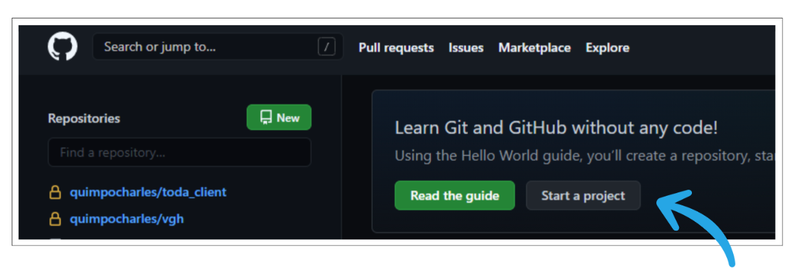
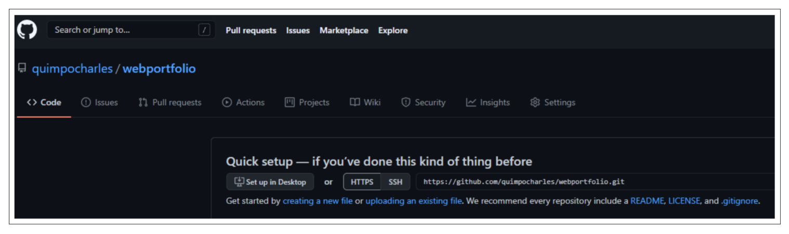

# Session Objectives

At the end of the session, the students are expected to:

- add styles and components to their developer portfolio web page as their 1st capstone project.

# Resources

## Instructional Materials

- [Google Slide Presentation](https://docs.google.com/presentation/d/1L6solhoi5BFAdsMwRxRg1ru_0e1RsWMXDEGgrIo-Ub4)
- [Sample CSP1 Project](https://teejaecalinao.github.io/charles-sample/)

Hide the link of the sample from the students by setting the browser to full-screen so that they cannot visit the site themselves.

Alternatively, clone the sample project to your local machine and show the page.

# Capstone 1 Requirements

## Specific Requirements

- General Page Styles
  - Custom web page font style using [Google Fonts](https://fonts.google.com/).
  - Add text and background colors to give your web page more life.
- Project Section
  - Add a button anchor just below the paragraph in React Frontend (Ecommerce) column. The link will be added once you are finished with your CSP3.
- Contact Section
  - Add social media links (e.g. Facebook, LinkedIn).
- Page Responsiveness
  - The page should maintain its responsiveness on three types of devices (mobile, tablet and desktop).
- Personal GitLab Repository
  - The project must be created in your own GitLab account, not inside your own batch subgroup folder.

## Reminders

- All custom CSS code must be in an external CSS file.
- There should be no ` ` elements in the source code.
- There should be no inline or internal CSS code.
- There should be no default web page fonts (Times New Roman).
- There should be no placeholder text in the page (like the Lorem Ipsum).
- There should be no horizontal scrolls when viewing the page.
- There should be no dead links.
- Do not create another website other than the required developer portfolio.
- Do not use templates found in other sites.

## Github Deployment

**NOTE**  

1. Create a Github account. [https://github.com/join]
   

2. Login to your Github account [https://github.com/login]
   

3. In your `Personal (Dashboard)`, click on the `Start a Project` button.
   

4. Add `webportfolio` as your repository name.
   

5. Set the visibility level for the repository to `Public`
   

6. Click on `Create Repository`
   

7. Copy the repository's `HTTPS URL`
   
   
   **Optional: Add an SSH Key for your Github Account [https://docs.github.com/en/github/authenticating-to-github/connecting-to-github-with-ssh/adding-a-new-ssh-key-to-your-github-account]**

8. Open your Terminal/Gitbash and go to your project folder

9. Run the command `git init` inside your capstone1 folder.
   

10. Add the Github remote repository by executing the command `git remote add github <paste the url from the Github repository>`. This will add an alias called github to your local project which represents the URL to your Github repository.
   

11. Push the project to your github repository.
   

12. Go to the repository's `Settings Tab` and click on `Pages`
   
   

13. Select the `master branch as the Source` and `root` as your root folder.
   

14. Click on Save. Doing this will deploy the project and will create a new link.
   

15. Sample Output: [https://teejaecalinao.github.io/charles-sample/]

16. In the frontend folder, create a new file called capstone.json which contains details of your capstone project.
   
   
   

# Instructor Notes

- Encourage students to ask questions.
