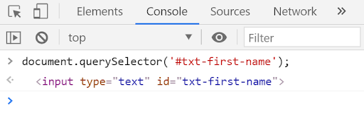
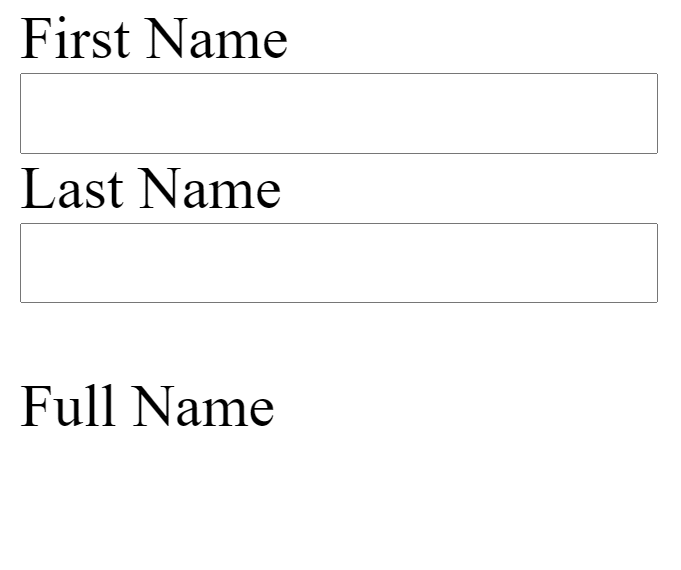

# Session Objectives

At the end of the session, the students are expected to:

- make web pages interactive by using JavaScript and its document object model.

# Resources

## Instructional Materials

- GitLab Repository
- Google Slide Presentation

## Supplemental Materials

- [JavaScript DOM Tutorial (JavaScript Tutorial)](https://www.javascripttutorial.net/javascript-dom/)
- [Introduction to the DOM (MDN Web Docs)](https://developer.mozilla.org/en-US/docs/Web/API/Document_Object_Model/Introduction)

# Lesson Proper

## Introduction to DOM

If cascading style sheets has a concept of box model, JavaScript has its own concept called **document object model**.

In JavaScript, each element in a webpage (document) such as images and text inputs can be considered an **object**.

Remember, an object in JavaScript contains information about a given object (such as properties and actions). In this case, the objects are the web page elements.

Using the DOM concept in JavaScript, we will be able to **access** or **modify** the properties of an element in a webpage.

We can do a lot of things using DOM. However, we will focus on using DOM for **managing form inputs**.

# Code Discussion

## Folder and File Preparation

Create a folder named **s57**, a folder named **discussion** inside the **s57** folder, then a file named **index.html** and **index.js** inside the **discussion** folder.

Add the following code to **index.html** file:

```html
<!DOCTYPE HTML>
<html>
    <head>
        <title>JavaScript DOM Manipulation</title>
    </head>
    <body>
        <span>First Name</span><br>
        <input type="text" id="txt-first-name"/><br>
        <span>Last Name</span><br>
        <input type="text" id="txt-last-name"/><br><br>
        <span>Full Name</span><br>
        <span id="span-full-name"></span>
        <script src="./index.js"></script>
    </body>
</html>
```

## Using the DOM

To retrieve an element from the webpage, we can use the following code:

```jsx
document.querySelector('#txt-first-name');
```

The **document** refers to the **whole webpage** and **querySelector** is used to **select** a **specific object** (HTML element) from the document (webpage).

The querySelector function takes a string input that is **formatted like a CSS selector** when applying styles. This allows us to get a specific element much like how CSS does it.

Alternatively, we can use the **getElement** functions to retrieve the elements.

```jsx
document.getElementById('txt-first-name');
document.getElementsByClassName('txt-inputs');
document.getElementsByTagName('input');
```

However, using these functions requires us to identify **beforehand** how we get the elements. With querySelector, we can be flexible in how to retrieve the elements.

When used in the DevTools console, it will look like this:



When the output is hovered, it will also highlight the element in the webpage.

We can **contain** the output of the code earlier to a **constant** so that we do not have to repeat the whole document.querySelector code.

## Event Listeners

Whenever a user interacts with a web page, this action is considered as an **event**.

An example of an event can be a **click**, a **hover**, a **page load**, a **keypress**, and many others things.

Working with events is a **large part** of creating **interactivity** in a webpage.

To perform an action when an event triggers, you first need to **listen** to it. Let's update our code earlier.

```jsx
const txtFirstName = document.querySelector('#txt-first-name');
const spanFullName = document.querySelector('#span-full-name');

txtFirstName.addEventListener('keyup', (event) => {
    spanFullName.innerHTML = txtFirstName.value;
})
```

We retrieved first the span that will contain the full name. Then added an event listener to the first name input.

The function used is **addEventListener** that takes two arguments: a **string identifying an event** and a **function** that the listener will **execute** once the specified event is **triggered**.

Multiple listeners can also be assigned to the same event.

```jsx
const txtFirstName = document.querySelector('#txt-first-name');
const spanFullName = document.querySelector('#span-full-name');

txtFirstName.addEventListener('keyup', (event) => {
    spanFullName.innerHTML = txtFirstName.value;
})

txtFirstName.addEventListener('keyup', (event) => {
    console.log(event.target);
    console.log(event.target.value);
})
```

The function being called when an event is triggered will **receive an argument** called **event**.

The **event** argument contains the information on the triggered event.

The **event.target** contains the element where the event happened and **event.target.value** gets the value of the input object (similar to the txtFirstName.value).

## Common Events

[List of Common Events](https://www.notion.so/f56115913c1141e9b707fedc58b52b31)

For a more comprehensive table of JavaScript DOM events, share the link below to the students.

[https://www.w3schools.com/jsref/dom_obj_event.asp](https://www.w3schools.com/jsref/dom_obj_event.asp)

# Activity

Answer and complete the Google Form - Mock Tech Exam to be provided by your instructor.

# Assignment

## Instructions

- Copy the **index.html** and **index.js** to the **activity** folder.
- Listen to an event when the last name's input is changed.
- Instead of anonymous functions for each of the event listener:
    - Create a function that will update the span's contents based on the value of the first and last name input fields.
    - Instruct the event listeners to use the created function.

## Expected Output



## Solution

```jsx
const txtFirstName = document.querySelector('#txt-first-name');
const txtLastName = document.querySelector('#txt-last-name');
const spanFullName = document.querySelector('#span-full-name');

const updateFullName = () => {
    let firstName = txtFirstName.value;
    let lastName = txtLastName.value;

    spanFullName.innerHTML = `${firstName} ${lastName}`;
}

txtLastName.addEventListener('keyup', updateFullName);
txtFirstName.addEventListener('keyup', updateFullName);
```