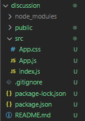
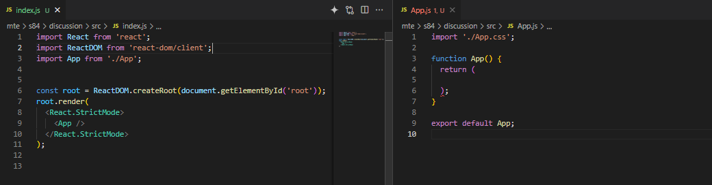

# MTE - App Building - FS - 1

## Resources

### References

Sample:

- [Starting A New React Project](https://react.dev/learn/start-a-new-react-project)
- [Deployment to Vercel](https://vercel.com/docs/deployments/overview)
    
### Tools/Technologies Version

    "react" - "^18.2.0"

## Code Discussion

### 1. Folder and File Preparation

- In the individual/MTE folder, create a new folder called s84.
- Copy our previous discussion API as **discussion-api** 
- Run the api using `npm run dev`
- In the s84 folder, create a new react application called discussion using the `npx creat-react-app <nameOfApp>` command

### 2. Step 1 - Review API Documentation

#### batchfolder > individual > s82 > discussion-api > project.txt

- Create a Full Stack Inventory Management Application with Simple CRUD Functionalities.

- Given that we already have an API, let's check the API document.

- The API documentation usually already contains the given routes and endpoints. We can create and integrate the API to our ReactJS application using this.

- Review the API documentation to identify the pages needed in the application

### 3. Initialize our ReactJS application.

#### batchfolder > individual > s84 > discussion > src 

- In the discussion folder, remove all unnecessary files.



- Update the app.js and index.js files.


- install needed dependencies

```bash

    npm install sweetalert2 react-router-dom react-bootstrap bootstrap

```
- For our simple use of context api, we can copy our previous Context API definition from our previous projects.

#### batchfolder > individual > s84 > discussion > src > UserContext.js

```js

import React from 'react';

const UserContext = React.createContext();

export const UserProvider = UserContext.Provider;

export default UserContext;

```

### 4. Create our Navbar

- Create our appnavbar component. In the src folder, create a new folder called components.
- Create a new file called AppNavBar.js

```js

import { useState } from 'react';
import Container from 'react-bootstrap/Container';
import Navbar from 'react-bootstrap/Navbar';
import Nav from 'react-bootstrap/Nav';

import { Link, NavLink } from 'react-router-dom';

export default function AppNavbar() {

	return(
		<Navbar bg="primary" expand="lg">
			<Container fluid>
			    <Navbar.Brand as={Link} to="/">Inventory</Navbar.Brand>
			    <Navbar.Toggle aria-controls="basic-navbar-nav" />
			    <Navbar.Collapse id="basic-navbar-nav">
				    <Nav className="ms-auto">
				        <Nav.Link as={NavLink} to="/" exact="true">Home</Nav.Link>
                        <Nav.Link as={Link} to="/login">Login</Nav.Link>
						<Nav.Link as={Link} to="/register">Register</Nav.Link>
                        <Nav.Link as={Link} to="/logout">Logout</Nav.Link>
				    </Nav>
			    </Navbar.Collapse>
			</Container>
		</Navbar>
		)
}

```

#### batchfolder > individual > s82 > discussion > src > App.js

- Add the navbar in our App.js

- import react-bootstrap, react-router-dom, UserContext and the component.

- You can also copy from our previous projects. Make sure to delete everything in the code except the following:

- For Now, We'll focus on quickly creating our login, register and logout pages.

```js

import { useState, useEffect } from 'react';
import { Container } from 'react-bootstrap';
import { BrowserRouter as Router } from 'react-router-dom';
import { Route, Routes } from 'react-router-dom';
import AppNavBar from './components/AppNavBar';

import './App.css';

import { UserProvider } from './UserContext';

function App() {

    //Add a global user state
    const [user, setUser] = useState({
      id: null,
      isAdmin: null
    });

  return (
    <UserProvider value={{user, setUser}}>
      <Router>
        <AppNavbar />
        <Container>
          <Routes>
            <Route path="/" element={<Home />} />
          </Routes>
        </Container>
      </Router>
    </UserProvider>
  );
}

export default App;

```

- Create a new folder called pages.

- Create a simple home page component for now.

#### batchfolder > individual > s82 > discussion > src > pages > Home.js

```js
import { Button, Row, Col } from 'react-bootstrap';
import { Link } from 'react-router-dom';

export default function Home() {

	return (
		<>
        <Row>
            <Col className="p-4 text-center">
                <h1>Welcome To our Inventory Manager</h1>
                <p>Create, Update, Delete and View Our Items</p>
                <Link className="btn btn-primary" to={'/items'}>Check Our Items</Link>
            </Col>
        </Row>
		</>
	)
}
```

- Check the output

### 5. Create Our Register Page

- Create a new file called Register.js in our pages folder.
- Review the schema and controller of the register route in the provided API.

- Import and Add the page in App.js

#### batchfolder > individual > s82 > discussion > src > App.js
```js

    /* ... */

    import AppNavbar from './components/AppNavbar';
    import Register from './pages/Register';

    /* ... */

        return (
            <UserProvider value={{user, setUser}}>
            <Router>
                <AppNavbar />
                <Container>
                <Routes>
                    <Route path="/" element={<Home />} />
                    <Route path="/register" element={<Register />} />
                </Routes>
                </Container>
            </Router>
            </UserProvider>
            );

    /* ... */

```

- Add the appropriate states and log in the console to check if the inputs are binded correctly.

#### batchfolder > individual > s82 > discussion > src > pages > Register.js

```jsx

import { useState, useEffect, useContext } from 'react';
import { Form, Button } from 'react-bootstrap';
import { Navigate } from 'react-router-dom';
import Swal from 'sweetalert2';
import UserContext from '../UserContext';

export default function Register() {

	const {user} = useContext(UserContext);

	const [email,setEmail] = useState("");
	const [password,setPassword] = useState("");
	const [confirmPassword, setConfirmPassword] = useState("");

    const [isActive, setIsActive] = useState(false);

	useEffect(()=>{

        console.log(email);
        console.log(password);
        console.log(confirmPassword);


	},[email,password,confirmPassword])
    

	return (

        <Form>
        <h1 className="my-5 text-center">Register</h1>
            <Form.Group>
                <Form.Label>Email:</Form.Label>
                <Form.Control 
                type="email"
                placeholder="Enter Email" 
                required 
                value={email} 
                onChange={e => {setEmail(e.target.value)}}/>
            </Form.Group>
            <Form.Group>
                <Form.Label>Password:</Form.Label>
                <Form.Control 
                type="password" 
                placeholder="Enter Password" 
                required 
                value={password} 
                onChange={e => {setPassword(e.target.value)}}/>
            </Form.Group>
            <Form.Group>
                <Form.Label>Confirm Password:</Form.Label>
                <Form.Control 
                type="password" 
                placeholder="Confirm Password" 
                required 
                value={confirmPassword} 
                onChange={e => {setConfirmPassword(e.target.value)}}/>
            </Form.Group>
            {
                isActive

                ? <Button variant="primary" type="submit">Submit</Button>
                : <Button variant="primary" disabled>Submit</Button>
            }
        </Form>
		
		)
}

```

- Next, add the appropriate validation check in the useEffect.

```js

    /* ... */

        useEffect(()=>{

		if((email !== "" && password !=="" && confirmPassword !=="") && (password === confirmPassword)){

			setIsActive(true)

		} else {

			setIsActive(false)

		}

	},[email,password,confirmPassword])

    /* ... */

```

- Check if the button is being disabled upon incomplete form or if it is being submitted otherwise

- Next, let's finally add our submit handler.

- Make sure to follow the given API's schema, especially in the body.

```js

        /* ... */

    	function registerUser(e) {

		e.preventDefault();

		fetch('http://localhost:4000/users/register',{

		method: 'POST',
		headers: {
			"Content-Type": "application/json"
		},
		body: JSON.stringify({

			email: email,
			password: password

		})
		})
		.then(res => res.json())
		.then(data => {

		//determine the returned data. Especially useful when the given API is online.
		console.log(data);

		//data will only contain an email property if we can properly save our user.
		if(data.message === "Registered Successfully"){

			setEmail('');
			setPassword('');
			setConfirmPassword('');

			Swal.fire({
        	    title: "Registration Successful",
        	    icon: "success",
        	    text: "Thank you for registering!"
        	});

		} 

		})
	}

    /* ... */

```

- Add the handler in the form

```js

    /* ... */

    <Form onSubmit={(e) => registerUser(e)}>
        <h1 className="my-5 text-center">Register</h1>
            <Form.Group>
                <Form.Label>Email:</Form.Label>
                <Form.Control 
                type="email"
                placeholder="Enter Email" 
                required 
                value={email} 
                onChange={e => {setEmail(e.target.value)}}/>
            </Form.Group>
            <Form.Group>
                <Form.Label>Password:</Form.Label>
                <Form.Control 
                type="password" 
                placeholder="Enter Password" 
                required 
                value={password} 
                onChange={e => {setPassword(e.target.value)}}/>
            </Form.Group>
            <Form.Group>
                <Form.Label>Confirm Password:</Form.Label>
                <Form.Control 
                type="password" 
                placeholder="Confirm Password" 
                required 
                value={confirmPassword} 
                onChange={e => {setConfirmPassword(e.target.value)}}/>
            </Form.Group>
            {
                isActive

                ? <Button variant="primary" type="submit">Submit</Button>
                : <Button variant="primary" disabled>Submit</Button>
            }
    </Form>

    /* ... */

```

- Add your first user using our page.

### 6. Create the login page

- Create a new file called Login.js in our pages folder.
- Review the schema and controller of the login route in the provided API.

- Import and Add the page in App.js

#### batchfolder > individual > s82 > discussion > src > App.js

```js

    /* ... */

    import AppNavbar from './components/AppNavbar';
    import Register from './pages/Register';
    import Login from './pages/Login';

    /* ... */

        return (
            <UserProvider value={{user, setUser}}>
            <Router>
                <AppNavbar />
                <Container>
                <Routes>
                    <Route path="/" element={<Home />} />
                    <Route path="/register" element={<Register />} />
                    <Route path="/login" element={<Login />} />
                </Routes>
                </Container>
            </Router>
            </UserProvider>
            );

    /* ... */

```

- Add the appropriate states and log in the console to check if the inputs are binded correctly.

#### batchfolder > individual > s82 > discussion > src > pages > Login.js

```jsx

import { useState, useEffect, useContext } from 'react';
import { Form, Button } from 'react-bootstrap';
import { Navigate } from 'react-router-dom'; 
import Swal from 'sweetalert2';
import UserContext from '../UserContext';

export default function Login() {

	const { user, setUser } = useContext(UserContext);

	const [email, setEmail] = useState('');
    const [password, setPassword] = useState('');

    const [isActive, setIsActive] = useState(true);

    useEffect(() => {

        console.log(email)
        console.log(password)

    }, [email, password]);

    return (
	    	
        <Form>
            <h1 className="my-5 text-center">Login</h1>
            <Form.Group controlId="userEmail">
                <Form.Label>Email address</Form.Label>
                <Form.Control 
                    type="text"
                    placeholder="Enter email"
                    value={email}
                    onChange={(e) => setEmail(e.target.value)}
                    required
                />
            </Form.Group>

            <Form.Group controlId="password">
                <Form.Label>Password</Form.Label>
                <Form.Control 
                    type="password" 
                    placeholder="Password"
                    value={password}
                    onChange={(e) => setPassword(e.target.value)}
                    required
                />
            </Form.Group>

                { isActive ? 
                <Button variant="primary" type="submit" id="submitBtn">
                    Submit
                </Button>
                : 
                <Button variant="danger" type="submit" id="submitBtn" disabled>
                    Submit
                </Button>
            }
        </Form>
    )
}

```

- Next, add the appropriate validation check in the useEffect.

```js

    /* ... */

        useEffect(()=>{

		if((email !== "" && password !=="") && (password === confirmPassword)){

			setIsActive(true)

		} else {

			setIsActive(false)

		}

	},[email,password])

    /* ... */

```

- Check if the button is being disabled upon incomplete form or if it is being submitted otherwise

- Next, let's finally add our submit handler and retrieve user details functions.

- Make sure to follow the given API's schema, especially in the body.

```js

        /* ... */

        function authenticate(e) {

            // Prevents page redirection via form submission
            e.preventDefault();
            fetch('http://localhost:4000/users/login',{

            method: 'POST',
            headers: {
                "Content-Type": "application/json"
            },
            body: JSON.stringify({

                email: email,
                password: password

            })
        })
        .then(res => res.json())
        .then(data => {

                console.log(data);

                localStorage.setItem('token', data.access);
                retrieveUserDetails(data.access);

                Swal.fire({
                    title: "Login Successful",
                    icon: "success",
                    text: "Welcome to Inventory!"
                });
            
            
        })

        setEmail('');
        setPassword('');

        }

        const retrieveUserDetails = (token) => {
            
            fetch('http://localhost:4000/users/details', {
                headers: {
                    Authorization: `Bearer ${ token }`
                }
            })
            .then(res => res.json())
            .then(data => {

                setUser({
                id: data.user._id,
                isAdmin: data.user.isAdmin
                });

            })

        };

    /* ... */

```

- Add the handler in the form

```js

    /* ... */

        <Form onSubmit={(e) => authenticate(e)}>
            <h1 className="my-5 text-center">Login</h1>
            <Form.Group controlId="userEmail">
                <Form.Label>Email address</Form.Label>
                <Form.Control 
                    type="text"
                    placeholder="Enter email"
                    value={email}
                    onChange={(e) => setEmail(e.target.value)}
                    required
                />
            </Form.Group>

            <Form.Group controlId="password">
                <Form.Label>Password</Form.Label>
                <Form.Control 
                    type="password" 
                    placeholder="Password"
                    value={password}
                    onChange={(e) => setPassword(e.target.value)}
                    required
                />
            </Form.Group>

                { isActive ? 
                <Button variant="primary" type="submit" id="submitBtn">
                    Submit
                </Button>
                : 
                <Button variant="danger" type="submit" id="submitBtn" disabled>
                    Submit
                </Button>
            }
        </Form>

    /* ... */

```

- Login our user using our page.

### 7. Create a logout page

- Back in the App.js, add a way to get the user details within the app from the localStorage. This is to prevent the reset of our global user state upon refresh.

#### batchfolder > individual > s82 > discussion > src > App.js
```js

    /* ... */
            useEffect(() => {

      fetch(`http://localhost:4000/users/details`, {
        headers: {
          Authorization: `Bearer ${ localStorage.getItem('token') }`
        }
      })
      .then(res => res.json())
      .then(data => {
        console.log(data)

        if (typeof data.user !== "undefined") {
  
          setUser({
            id: data.user._id,
            isAdmin: data.user.isAdmin
          });
  
        } else {
  
          setUser({
            id: null,
            isAdmin: null
          });
  
        }
  
      })
  
      }, []);
    /* ... */

```
- Then, let's add our logout page.

- Create a new page called Logout in the pages folder.

#### batchfolder > individual > s82 > discussion > src > pages > Logout.js
```js

import { useContext, useEffect } from 'react';
import { Navigate } from 'react-router-dom';
import UserContext from '../UserContext';

export default function Logout() {

    const { unsetUser, setUser } = useContext(UserContext);

    localStorage.clear();

    useEffect(() => {

        setUser({
            id: null,
            isAdmin: null
        });

    }, [])

    // Navigate back to login
    return (
        <Navigate to='/login' />
    )

}

```

- Test your page

### 8. Conditional Rendering - AppNavBar

- Let's prevent access in the login and register page upon login.

- Unwrap the user context in the appnavbar and then add conditional rendering by embedding JSX in the elements.

#### batchfolder > individual > s82 > discussion > src > components > AppNavBar.js
```js

import { useState, useContext } from 'react';
import Container from 'react-bootstrap/Container';
import Navbar from 'react-bootstrap/Navbar';
import Nav from 'react-bootstrap/Nav';

import { Link, NavLink } from 'react-router-dom';

import UserContext from '../UserContext';

export default function AppNavbar() {

    const { user } = useContext(UserContext);

	return(
		<Navbar bg="primary" expand="lg">
			<Container fluid>
			    <Navbar.Brand as={Link} to="/">Inventory</Navbar.Brand>
			    <Navbar.Toggle aria-controls="basic-navbar-nav" />
			    <Navbar.Collapse id="basic-navbar-nav">
				    <Nav className="ms-auto">
				        <Nav.Link as={NavLink} to="/" exact="true">Home</Nav.Link>
                        {
                            user.id
                            ?
                            <>
                                <Nav.Link as={Link} to="/logout">Logout</Nav.Link>
                            </>
                            :
                            <>
                                <Nav.Link as={Link} to="/login">Login</Nav.Link>
                                <Nav.Link as={Link} to="/register">Register</Nav.Link>
                            </>

                        }
				    </Nav>
			    </Navbar.Collapse>
			</Container>
		</Navbar>
		)
}

```

- You can complete the rest of the application as a take-home activity.
- Add the Items page, Add Items Page, Update Items and Delete Items feature

## Activity

### Activity References


### Activity Instructions

- Type of Activity:
    - Coding
    - Individual

#### Instructions

**Activity 1**
1. In the MTE/s84 folder, create a folder called activity
2. Copy your previous API from Session 82.
3. Create a simple Fitness Tracker Full Stack App: Integrate the fitness tracking application where users can log their workouts and track their progress over time. 
    - A user should be able to add, retrieve, update, and delete workouts.
        - Users can only access their own workout documents.
    - Each workout should include exercise type, duration, date/time, progress and status.
        - date/time does not need to be Date type.
    - A user should be able to register and login.
    - A user should be able to check all the workouts but only their own.
4. Add, commit and push your updates to your individual repo.
5. Add the individual repo link in Boodle as s84 - App Building - FS - 1

#### Activity Solution:

**Solution will vary from each student. This will be graded automatically using endpoint jsons.**
